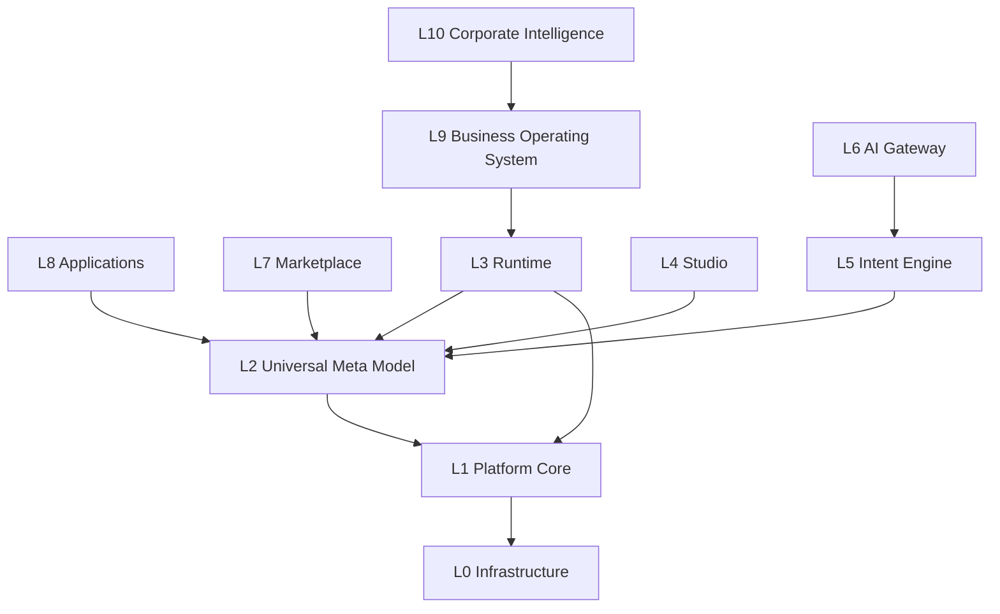

# 01 — Platform Layers (L0–L10)

**Status:** Official SSOT · **Version:** 1.0.0 · **Decision:** D-PA-01, D-PA-02

---

## Canonical layer model

---

## Layer specifications

### L0 — Infrastructure

| Responsibility | Components |
|----------------|------------|
| Compute & network | Railway, Vercel, CDN, edge nodes |
| Data stores | PostgreSQL (primary), Redis (cache), object storage |
| Secrets | Vault / env secrets, signing keys (`MMM_SIGNING_KEY`, JWT) |
| Observability | Logs, metrics, traces |

**Contracts:** L1 receives connection strings via env; never exposed to L3+.

---

### L1 — Platform Core

| Responsibility | Components |
|----------------|------------|
| Identity & tenant | Auth, JWT, `cliente_id`, session |
| RBAC enforcement API | Role/Permission (target MMM 4.07) |
| Event Bus | Domain events (D-PA-17) |
| Job scheduler | Async publish, sync, retention |
| API gateway | Fastify routes, rate limit |
| Audit | Immutable audit log |

**Depends on:** L0  
**Consumed by:** L2, L3, L4, L6, L7, L9, L10  
**Never knows:** Studio UI, BOS widgets, AI prompts

---

### L2 — Universal Meta Model

| Responsibility | Components |
|----------------|------------|
| Definition SSOT | 227 types, 226 PlatformSchemas, envelope |
| Persistence | `mmm_object*` + publish tables (4.03–4.04) |
| Publish | C-1→C-16 → `mmm-crb-v1` |
| Validation | JSON Schema + semantic rules |
| Versioning | DefinitionVersion, EnvironmentPin |

**Depends on:** L1 (auth, audit)  
**Consumed by:** L3 (CRB), L4 (CRUD API), L7 (packages)  
**SSOT:** [docs/meta-model/](../meta-model/)

**Legacy:** MDP (`/api/mdp/*`) = transitional substrate only (D-MMM-01).

---

### L3 — Runtime

| Responsibility | Components |
|----------------|------------|
| CRB load & verify | RT-1, RT-2 |
| Registry hydration | RT-3 (V13–V20) |
| Session & auth context | RT-4 |
| Authorization | RT-5 |
| Routing | RT-6 |
| Render | RT-7 ([07-RENDER-ENGINE.md](./07-RENDER-ENGINE.md)) |
| Execute | RT-8 (actions, workflows) |

**Depends on:** L2 (CRB), L1 (auth, events), L0 (records via GR)  
**Never reads:** draft MMM objects, Studio state

---

### L4 — Studio

| Responsibility | Components |
|----------------|------------|
| Visual designers | 17 designers ([03-STUDIO.md](./03-STUDIO.md)) |
| MMM API client | `/api/mmm/v1` |
| Preview | Draft CRB compile (non-prod pin) |
| Expert Mode entry | Gated from BOS |

**Depends on:** L2, L1  
**Never:** bypasses MMM API to write DB

---

### L5 — Intent Engine

| Responsibility | Components |
|----------------|------------|
| Business Language parse | NL → Intent Document |
| Resolver | Intent → DerivationPlan |
| Confirmation | Human approval gate |
| Batch write | `/api/mmm/v1/objects/batch` |

**Depends on:** L2 API, L1  
**SSOT:** [meta-model/21-INTENT-ENGINE.md](../meta-model/21-INTENT-ENGINE.md)

---

### L6 — AI Gateway

| Responsibility | Components |
|----------------|------------|
| Provider abstraction | LLM/vendor agnostic |
| AICandidate emission | Never direct MMM write |
| Plan limits | Feature flags per tenant plan |
| Prompt governance | Tenant-scoped, audited |

**Depends on:** L1, L5 (Intent path)  
**SSOT:** [meta-model/22-AI-GATEWAY.md](../meta-model/22-AI-GATEWAY.md)

---

### L7 — Marketplace

| Responsibility | Components |
|----------------|------------|
| Publish/list packages | `.makpkg` |
| Purchase & license | Entitlement records |
| Install | Draft MMM objects + lineage |
| Updates & rollback | Version pin |

**Depends on:** L2, L1  
**SSOT:** [12-MARKETPLACE.md](./12-MARKETPLACE.md)

---

### L8 — Applications

| Responsibility | Components |
|----------------|------------|
| Product packages | ERP, CRM, WMS, RH |
| Module composition | Application → modules |
| Deployment unit | Pin per application optional |

**Depends on:** L2 published CRB  
**Not a code layer** — logical packaging of MMM objects

---

### L9 — Business Operating System

| Responsibility | Components |
|----------------|------------|
| Primary UX | Home, objectives, capabilities, assets |
| Business Language UI | Default authoring |
| Operations queues | Human tasks |
| Health & recommendations | L10 projections |

**Depends on:** L3 Runtime, L5 Intent  
**SSOT:** [11-BOS.md](./11-BOS.md)

---

### L10 — Corporate Intelligence

| Responsibility | Components |
|----------------|------------|
| Memory, Knowledge Graph | Event ingestion |
| Consulting, Decision, Evolution | Read-only analysis |
| Portfolio, Governance | Executive views |

**Depends on:** L1 Event Bus, L9 BOS  
**Rule:** No direct MMM mutation (D-PA-21)

---

## MAK-2035 compatibility map

| MAK-2035 | Platform L0–L10 |
|----------|-----------------|
| L0 Data & Infra | L0 |
| L1 Domain Modules | L8 (thin hooks) + transitional |
| L2 Foundation Runtime | L3 Runtime (engines V13–V20) |
| L3 Platform Core | L1 |
| L4 MDP / MMM | L2 |
| L5 Studio | L4 |
| L6 Platform Services | L6 + L7 + L10 |
| L7 Experience | L9 + clients |

---

## Layer immutability rules

| Rule | Detail |
|------|--------|
| Downward dependency only | L9 may call L3; L3 never calls L9 |
| CRB boundary | L3+ never parse raw MMM except L4/L5 via API |
| Foundation freeze | V13–V20 engine **code** frozen; config from CRB evolves |
| No skip layers | Studio cannot write PostgreSQL business tables directly |

---

*End of document.*
