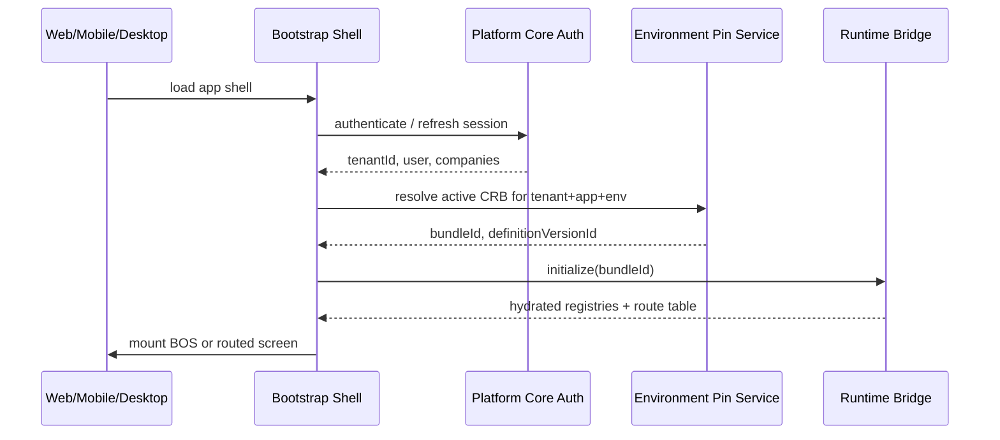
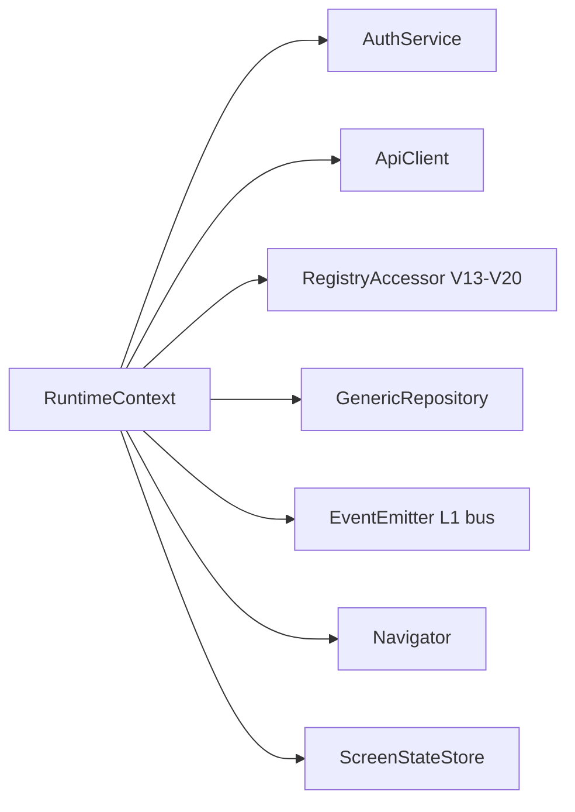

# 02 — Runtime Architecture

**Status:** Official SSOT · **Version:** 1.0.0 · **Decision:** D-PA-03, D-PA-04  
**Supersedes presentation:** [meta-model/16-RUNTIME.md](../meta-model/16-RUNTIME.md) (detail retained there; this doc is **complete** pre-4.05 spec)

---

## Objective

Define **complete Runtime behavior** before Program 4.05 implementation — birth through rollback, without code.

---

## How Runtime is born (RT-0 Bootstrap)

| Step | Input | Output |
|------|-------|--------|
| Shell load | `index.html`, Vite bundle | Bootstrap context |
| Auth | JWT / session | `AccessScope` (tenant, user, companies) |
| Pin resolve | tenant, applicationId, moduleId, environment | CRB reference |
| Bridge init | CRB payload | In-memory registries |

**Rule:** Bootstrap **never** loads `generatedModules.json` as SSOT after Foundation C (D-PA-03).

---

## How Runtime loads (RT-1 → RT-3)

| Phase | Action | Failure mode |
|-------|--------|--------------|
| RT-1 Load Pin | Fetch EnvironmentPin → bundleId | Fail-closed: maintenance screen |
| RT-2 Verify CRB | Check `crbVersion`, `integrityHash`, `signatureRef` | Reject load; alert ops |
| RT-3 Hydrate | Map CRB.registries → V13–V20 engine configs | Abort if schema mismatch |

**Cache:** Hydrated registries cached in memory + Redis (`mmm:crb:{tenant}:{module}`) invalidated on publish C-16.

---

## How Runtime executes (RT-4 → RT-8)

| Phase | Responsibility |
|-------|----------------|
| RT-4 Session | Bind user, tenant, selected company, locale |
| RT-5 Authorize | Evaluate permission registry (resource + action + effect) |
| RT-6 Route | Match URL → route entry → screen/layout objectId |
| RT-7 Render | Render Engine selects view adapter |
| RT-8 Execute | Action Engine / Workflow Engine / API integrations |

---

## Service injection model

| Service | Source | Lifetime |
|---------|--------|----------|
| RegistryAccessor | CRB hydrate | App session |
| GenericRepository | L0 adapter factory | Request-scoped |
| EventEmitter | L1 bus client | Singleton per tenant |
| ScreenStateStore | React context / equivalent | Route-scoped |

**Rule:** No service reaches into MMM DB from Runtime (D-PA-03).

---

## Dependency resolution

| Dependency kind | Resolved from |
|-----------------|---------------|
| Field → BO | CRB field registry |
| Layout → fields | CRB layout registry |
| Action → workflow | CRB action + workflow registries |
| Module → module | CRB + module_dependency objects at publish |
| Plugin | CRB integration registry |

Runtime builds **dependency graph at hydrate time** (read-only). Circular config rejected at publish C-5.

---

## Session control

| Attribute | Storage | TTL |
|-----------|---------|-----|
| JWT access | HttpOnly cookie / Authorization header | Short |
| Refresh | Secure storage | Medium |
| Selected company | Session + user preference | Persistent per user |
| AccessScope cache | Redis + in-memory | 5s default |

Multi-company: `acesso_global` vs `PermissaoEmpresa` enforced at RT-5.

---

## Cache control

| Cache | Key pattern | Invalidation |
|-------|-------------|--------------|
| CRB hydrate | `mmm:crb:{tenant}:{module}` | Publish C-16 |
| Access scope | `auth:scope:{userId}` | Login/logout/permission change |
| Record list | `gr:list:{tenant}:{bo}:{hash}` | Record mutation events |
| Static assets | CDN | CRB version bump |

---

## Security control

| Control | Phase |
|---------|-------|
| TLS | L0 |
| JWT validation | RT-4 |
| Tenant isolation | All queries include tenantId |
| Permission check | RT-5 before RT-7/RT-8 |
| CSRF | L1 for cookie auth |
| Signature verify | RT-2 mandatory in production |

---

## Permission control

Permissions compile from MMM `permission` objects → CRB permission registry.

Evaluation order: **deny > allow > default deny** (fail-closed).

---

## State control

| State type | Owner |
|------------|-------|
| Screen filters, pagination | ScreenStateStore (ephemeral) |
| User preferences | L1 preference API |
| Draft form values | ScreenStateStore until save |
| Workflow instance state | Workflow Engine persistent store |
| Published config | CRB (immutable until new publish) |

---

## Event control

Runtime emits domain events **only through L1 Event Bus** — never direct Intelligence calls.

Events: `record.created`, `action.executed`, `workflow.transitioned`, `screen.viewed`.

---

## API control

Runtime uses **Internal API** (`/api/*`) via typed client — never Public API from browser without gateway rules.

Record CRUD: Generic Repository → backend adapters → PostgreSQL.

---

## Module control

Modules exist as **CRB metadata** (`moduleId` scope on objects). Runtime does not load JS module factories post Foundation E.

Transitional: `generatedModules.json` mirror until 4.14.

---

## Application control

`applicationId` in scope filters routes and menu trees. Multi-app tenants pin CRB per application (optional) or share module CRB with application tags.

---

## Plugin control

Plugins = `integration` + `plugin_manifest` in CRB. Loaded at RT-3. **No eval**, no remote script injection — manifest declares endpoints and capabilities only (D-PA-23).

---

## Version control

| Artifact | Version key |
|----------|-------------|
| CRB | `crbVersion: mmm-crb-v1` |
| Definition | `definitionVersionId`, `revision` |
| Client app | npm package / deploy tag (independent) |

Runtime rejects CRB if `crbVersion` unsupported.

---

## Rollback control

**Operational rollback** = repin EnvironmentPin to prior DefinitionVersion (immutable CRB unchanged).

Runtime hot-swaps registries on pin change event — no code deploy required.

---

## CRB control

| Rule | Detail |
|------|--------|
| SSOT | CRB is sole config source at runtime |
| Immutability | Post-sign CRB never mutated |
| Introspection | CRB.objects[] copy for debug only |
| Multi-client | Filter by `clientTargets` |

---

## Client targets

| Target | Runtime profile |
|--------|-----------------|
| web | Full Render Engine |
| mobile | Reduced view set + offline read cache |
| desktop | web + native shell |
| embedded | widget subset RT-7 |

---

## Transitional state (today)

| Component | Status |
|-----------|--------|
| ModeloBase1 | Active render template |
| Boot cache JS | Transitional SSOT — **eliminate Foundation E** |
| Runtime Bridge pilot | empresas partial |
| MMM CRB | Published via 4.04 — consumption 4.05 |

---

*End of document.*
