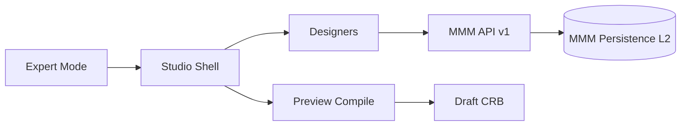

# 03 — Studio Architecture

**Status:** Official SSOT · **Version:** 1.0.0 · **Decision:** D-PA-07

---

## Objective

Define **complete Studio architecture** — designers, flows, contracts — without implementation.

---

## Studio position

Studio is **L4 Expert authoring**. It edits MMM objects exclusively via `/api/mmm/v1`. Studio is **not** product identity (D-074); entry from BOS Expert Mode only.

---

## Designer catalog (normative — closed)

| # | Designer | MMM objectTypes | Purpose |
|---|----------|-----------------|---------|
| 1 | **Application Designer** | `application`, `application_version` | Product boundary |
| 2 | **Module Designer** | `module`, `module_dependency` | Domain modules |
| 3 | **Entity Designer** | `business_object`, `entity_kind` | Data entities |
| 4 | **Field Designer** | `field`, `field_config` | Fields & configs |
| 5 | **Relationship Designer** | `relationship` | BO links |
| 6 | **Layout Designer** | `layout`, `section`, `panel`, `tab`, `group` | Screen structure |
| 7 | **View Designer** | `view`, `form` | Presentation views |
| 8 | **Navigation Designer** | `menu`, `route` | Menus & routes |
| 9 | **Workflow Designer** | `workflow`, `workflow_step` | Processes |
| 10 | **Automation Designer** | `automation`, `trigger` | Event automations |
| 11 | **Dashboard Designer** | `dashboard`, `widget` | Analytics boards |
| 12 | **Report Designer** | `report`, `query` | Reports |
| 13 | **Permission Designer** | `role`, `permission` | RBAC |
| 14 | **Theme Designer** | `theme`, `style_token` | Visual theme |
| 15 | **Integration Designer** | `integration`, `connector` | External systems |
| 16 | **Marketplace Publisher** | `package`, `package_version` | Export .makpkg |
| 17 | **Intent Designer** | `derivation_plan`, `intent_binding` | Intent templates |

**Supporting panels (not separate designers):** AI Assistant (read-only suggest → AICandidate), Formula Builder (V17), Validation Builder (V16), Event Builder (V18), Action Builder (V19).

---

## Studio shell regions

| Region | Function |
|--------|----------|
| Navigator | Object tree by module |
| Canvas | Active designer surface |
| Inspector | Payload properties + labels |
| Dependency graph | Visual `dependencies` |
| Lifecycle bar | Status transitions (draft→review→approved) |
| Publish trigger | Delegates to Publish Engine — never direct CRB write |

---

## Authoring flow

1. Open object (draft) from MMM API  
2. Edit via designer → PATCH envelope  
3. Validation inline (PlatformSchema)  
4. Submit review → `review`  
5. Approver → `approved`  
6. Publish scope → Publish Engine → CRB  

Studio **never** sets `published`/`active` directly (S-05).

---

## Preview mode

Studio requests **draft compile** (non-persisted CRB) for preview iframe. Preview uses staging pin sandbox — never production pin.

---

## Contracts

| Contract | Detail |
|----------|--------|
| C-ST-01 | All writes via MMM API with revision |
| C-ST-02 | Designers read PlatformSchema from `/schemas/{type}` |
| C-ST-03 | Studio session uses same AccessScope as Runtime |
| C-ST-04 | AI Assistant outputs AICandidate objects only |

---

## Relationship to frozen Studio foundation

Programs 2.0–2.3.5 engines (G262–G306) remain **frozen code**. Studio designers are **configuration UI** over MMM — they consume engines, do not replace them.

---

*End of document.*
