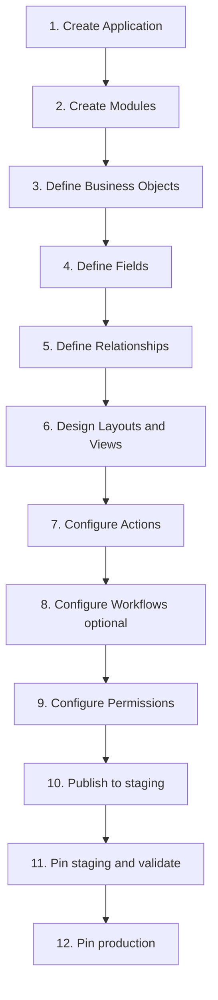

# 04 — Low-Code Architecture

**Status:** Official SSOT · **Version:** 1.0.0 · **Decision:** D-PA-08

---

## Objective

Define how **any business system** is created from zero using **configuration only** — manual path without AI.

---

## Principles

| # | Principle |
|---|-----------|
| LC-01 | No application code for certified modules |
| LC-02 | All definitions are MMM objects |
| LC-03 | Publish produces CRB; Runtime executes |
| LC-04 | Records hold business data — not MMM objects |
| LC-05 | Business Language is default; Studio is expert alternative |

---

## Creation path (universal)

---

## By system type

### ERP (Finance + Operations)

| Step | MMM objects |
|------|-------------|
| Application | `erp_core` application |
| Modules | financeiro, compras, estoque, fiscal |
| BOs | invoice, payment, product, supplier |
| Workflows | approval chains for PO, invoice |
| Dashboards | cash flow, AP/AR aging |

### CRM

| Modules | vendas, marketing, suporte |
| BOs | lead, opportunity, account, activity |
| Views | pipeline kanban, timeline |
| Automations | lead scoring triggers |

### WMS

| Modules | warehouse, logistics |
| BOs | location, stock_movement, pick_list |
| Views | map, kanban picking |
| Integrations | carrier APIs |

### RH (HR)

| Modules | rh, ponto, folha |
| BOs | employee, leave_request, payroll_run |
| Workflows | leave approval |
| Permissions | manager vs employee roles |

**All four follow identical path** — only object graphs differ.

---

## Authoring surfaces

| User | Surface | Path |
|------|---------|------|
| Business user | BOS + Business Language | Intent → derivation |
| Expert | Studio designers | Direct MMM edit |
| Platform ISV | Studio + Marketplace Publisher | Package export |

---

## Zero-code boundary

| Allowed without code | Requires L1 exception code |
|---------------------|----------------------------|
| CRUD screens | Complex fiscal calculation engines |
| Workflows & approvals | Legacy integration with no connector |
| Dashboards & reports | Performance-critical batch ETL |
| Computed fields (V17) | Custom crypto |
| Integrations via connector | — |

Exception code lives in **L8 application plugin** manifest — not in module JS factory (Foundation E eliminates factories).

---

## Validation gates before production pin

| Gate | Check |
|------|-------|
| Schema | All objects pass PlatformSchema |
| Semantic | BO has fields, workflow has initial step |
| Security | Permissions for all routes |
| Publish | C-1→C-16 PASS |
| UAT | Staging pin smoke |

---

*End of document.*
