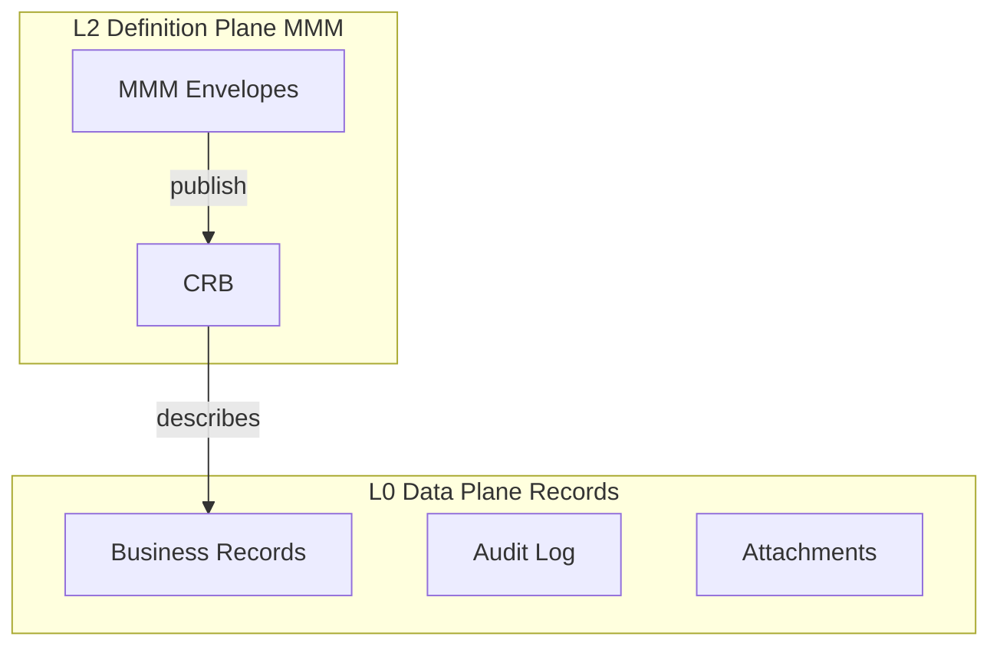

# 06 — Universal Data Model

**Status:** Official SSOT · **Version:** 1.0.0 · **Decision:** D-PA-16, D-PA-18

---

## Two planes of data

| Plane | Mutability | Versioning |
|-------|------------|------------|
| MMM | Lifecycle-managed | objectId stable, revision increments |
| Records | CRUD | id_global + tenant scope |
| CRB | Immutable post-sign | DefinitionVersion |

---

## CRUD model

| Operation | MMM object | Record |
|-----------|------------|--------|
| Create | POST `/objects` (draft) | GR.create via Runtime action |
| Read | GET `/objects/{id}` | GR.list/get |
| Update | PATCH (revision lock) | GR.update + validation from CRB |
| Delete | Soft delete status | GR.delete or archive per policy |

Record validation uses **Field configs from CRB** (V14), not hardcoded Zod in modules (target).

---

## Events

| Event source | Bus | Consumers |
|--------------|-----|-----------|
| Record CRUD | L1 Domain Event Bus | Workflow, Automation, L10 Intelligence |
| MMM lifecycle | `mmm.object.*` | Audit, Studio sync |
| Publish | `mmm.publish.completed` | Runtime cache invalidation |
| Marketplace install | `marketplace.package.installed` | BOS notifications |

All events **tenant-scoped** (R-05).

---

## Relationships

| Type | Storage |
|------|---------|
| BO ↔ BO | `relationship` MMM + FK or link table via GR adapter |
| Record ↔ Record | GR foreign keys / EAV links |
| MMM object refs | `dependencies` JSON on envelope |

---

## Versioning & snapshots

| Artifact | Mechanism |
|----------|-----------|
| MMM object | `revision` + `mmm_object_version` |
| Publish | `mmm_definition_version` + publish snapshot |
| Record | Optional row versioning per BO policy (future GR feature) |
| Package | `package_version` semver |

---

## Synchronization

| Mode | Architecture |
|------|--------------|
| Online | Runtime → API → PostgreSQL |
| Offline read | Cached CRB + record replica on device |
| Offline write | Outbox queue → sync on reconnect |
| Multi-device | Sync service L1 resolves conflicts (last-write-wins per field policy) |

MMM authoring **requires online** except read-only Studio preview.

---

## API data access

| API | Data |
|-----|------|
| `/api/mmm/v1/*` | MMM envelopes |
| `/api/cadastro/*` | Records (transitional) |
| GR unified | `/api/gr/v1/{boCode}/*` (Foundation C+) |

---

## Import / export

| Operation | Format |
|-----------|--------|
| MMM export | `.makpkg` JSON envelope archive |
| Record import | CSV/Excel via integration action |
| Record export | Report engine / action |
| Full tenant backup | Snapshot of MMM + DB slice |

---

## Marketplace data flow

Install: `.makpkg` → validate → create draft MMM objects → review → publish → CRB update → Records unchanged until user runs migrations.

---

*End of document.*
