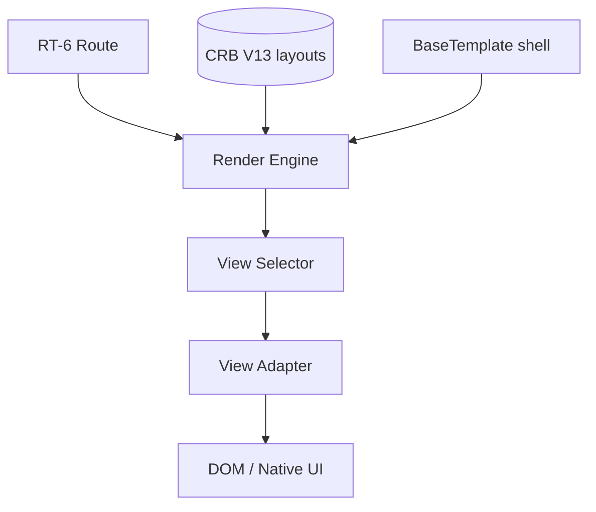

# 07 — Universal Render Engine

**Status:** Official SSOT · **Version:** 1.0.0 · **Decision:** D-PA-04, D-PA-25

---

## Position

Render Engine is **Runtime phase RT-7** — not a separate layer. It interprets CRB layout/view registries (V13) and renders through **view adapters**.

---

## View catalog (closed)

| View mode | Adapter | CRB source | Primary use |
|-----------|---------|------------|-------------|
| **table** | TableAdapter | view + layout grid | Lists, cadastro |
| **cards** | CardsAdapter | view card template | Mobile-first lists |
| **calendar** | CalendarAdapter | view date field mapping | Scheduling |
| **kanban** | KanbanAdapter | view status column | Pipeline |
| **timeline** | TimelineAdapter | view event stream | History |
| **dashboard** | DashboardAdapter | dashboard + widgets | KPIs |
| **map** | MapAdapter | view geo fields | Logistics |
| **tree** | TreeAdapter | hierarchical relationship | Categories |
| **form** | FormAdapter | form layout | Create/edit |
| **wizard** | WizardAdapter | multi-step form | Onboarding |
| **shell** | ShellAdapter | BOS / app chrome | Navigation frame |

---

## Rendering pipeline

1. Resolve `layoutId` + `viewId` from route  
2. Load field configs (V14) for BO  
3. Fetch record data via GR  
4. Apply theme tokens (theme object)  
5. Select adapter by `viewMode`  
6. Bind actions (V19) to controls  
7. Emit render events  

---

## Layout composition

| Element | Nesting |
|---------|---------|
| layout | root |
| section → panel → tab → group | hierarchical |
| field | leaf binding |

Drag-order from CRB `sortOrder` — Studio Layout Designer writes MMM objects.

---

## Client targets

| Target | Adapter subset |
|--------|----------------|
| Desktop web | All 11 |
| Mobile web | cards, form, list, shell |
| PWA | Same as mobile + offline cache |
| Desktop native | shell + form + dashboard |

`clientTargets` on CRB filters available adapters.

---

## BaseTemplate binding

Default: **modelobase1** (frozen). Template defines chrome, toolbar, save/delete action slots.

Future templates register as `base_template` MMM objects — Render Engine selects by `baseTemplateId`.

---

## Performance rules

| Rule | Detail |
|------|--------|
| Virtual scroll | table/cards > 200 rows |
| Lazy load | dashboard widgets |
| Memoization | field config by objectId |
| No layout thrash | stable keys from objectId |

---

*End of document.*
