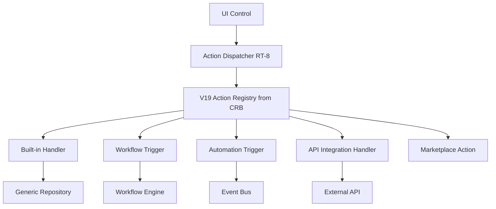

# 08 — Action Engine

**Status:** Official SSOT · **Version:** 1.0.0 · **Decision:** D-PA-05

---

## Objective

Define how **every button and operation** executes uniformly — save, delete, publish, workflow, API, marketplace.

---

## Architecture

---

## Action object model

MMM `action` objectType → CRB action registry entry:

| Field | Purpose |
|-------|---------|
| code | Stable handler key |
| actionKind | crud, navigate, workflow, integration, custom |
| targetRef | BO, workflow, integration id |
| permissionRef | Required permission |
| confirmation | UX gate |
| sideEffects | Events emitted |

---

## Built-in action catalog (closed)

| Action | actionKind | Handler |
|--------|------------|---------|
| save | crud | GR.create/update |
| delete | crud | GR.delete (soft/hard per policy) |
| duplicate | crud | GR.clone |
| publish | lifecycle | Publish API scope |
| navigate | navigate | Router |
| refresh | ui | Reload data |
| export | integration | Report/export service |
| import | integration | Import pipeline |
| install_package | marketplace | Marketplace install |

Custom actions declare `integration` handler — no inline JS.

---

## Execution contract

| Step | Responsibility |
|------|----------------|
| 1 | RT-5 permission check |
| 2 | Validate preconditions (validation V16) |
| 3 | Execute handler atomically where required |
| 4 | Emit domain events |
| 5 | Return structured result to UI |

Failures roll back transaction (records) or leave MMM unchanged.

---

## Workflow & automation triggers

Actions may `triggerWorkflow` or `emitAutomation` — delegated to [09-WORKFLOW-ENGINE.md](./09-WORKFLOW-ENGINE.md).

---

*End of document.*
