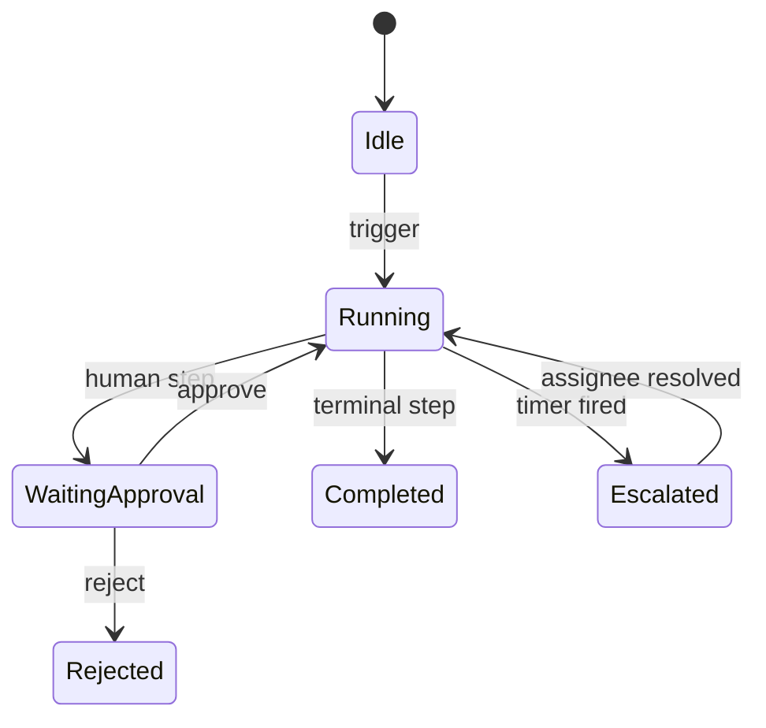

# 09 — Workflow Engine

**Status:** Official SSOT · **Version:** 1.0.0 · **Decision:** D-PA-06

---

## Objective

Universal workflow motor — states, events, timers, approval, escalation, queues.

---

## Architecture

| Component | Source |
|-----------|--------|
| Definition | MMM `workflow` + `workflow_step` → CRB V20 |
| Instance store | L0 PostgreSQL `workflow_instance` |
| Executor | Runtime RT-8 sub-engine |
| Human tasks | BOS Operations queue |

---

## Workflow definition model

| Element | Required |
|---------|----------|
| initialStepRef | Yes (S-02) |
| steps[] | Yes |
| transitions[] | condition + target |
| timers[] | escalation rules |
| approvers[] | role/user refs |

---

## State machine rules

| Rule | Detail |
|------|--------|
| Single active step | Per instance |
| Deterministic transitions | Evaluated in order |
| Idempotent triggers | Duplicate events ignored |
| Audit | Every transition logged |

---

## Timers

| Timer type | Use |
|------------|-----|
| SLA | Due date escalation |
| Reminder | Notification |
| Auto-complete | System step after delay |

Timers scheduled via L1 job scheduler — not browser timers.

---

## Approval

| Stage | Actor |
|-------|-------|
| Submit | Author |
| Review | Role from permission |
| Escalate | Manager chain |
| Final | Publish if config requires |

Integrates with lifecycle approval (Program 3.26) for data actions; workflow approval for business process.

---

## Queues

| Queue | Surface |
|-------|---------|
| My tasks | BOS Operations |
| Team queue | Role-based |
| Escalation | Priority lane |

---

## Events

Workflow emits: `workflow.started`, `workflow.transitioned`, `workflow.completed`, `workflow.escalated`.

---

*End of document.*
