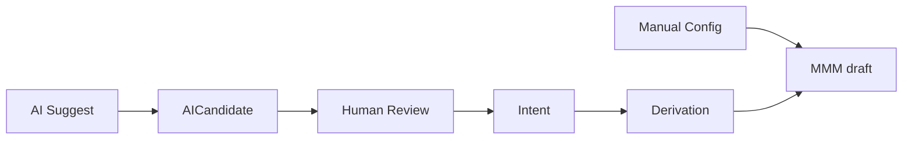

# 10 — AI Architecture

**Status:** Official SSOT · **Version:** 1.0.0 · **Decision:** D-PA-09, D-PA-21

---

## Where AI enters

| Layer | AI role |
|-------|---------|
| L6 AI Gateway | Provider calls, guardrails, metering |
| L5 Intent | NL → Intent Document (optional accelerator) |
| L9 BOS | AI Assistant panel (suggestions) |
| L4 Studio | AI Assistant → AICandidate only |
| L10 Intelligence | Analysis, recommendations (read-mostly) |

---

## Where AI never enters

| Forbidden | Reason |
|-----------|--------|
| Direct MMM write | D-MMM-09, D-074 P-09 |
| Direct Record write without action | Audit bypass |
| Production pin change | Human-only |
| Permission grant | Security |
| Bypass human review for AI candidates | S-04 |

---

## AI optional vs manual

| Mode | Path |
|------|------|
| **Manual** | Studio/BOS → MMM API |
| **AI-assisted** | Prompt → AICandidate → approve → Intent → batch |
| **Pure manual always available** | AI feature-flagged per plan |

---

## Plan gates

| Plan | AI features |
|------|-------------|
| Free | None |
| Business | BOS assistant, suggestions |
| Enterprise | + Intent generation, derivation assist |
| Platform | + custom models via AI Gateway |

Enforced at L6 — fail-closed.

---

## AICandidate → MMM pipeline

1. AI Gateway produces `ai_candidate` payload (`humanReviewRequired: true`)  
2. Reviewer approves in BOS/Studio  
3. Resolver builds DerivationPlan  
4. Batch create MMM objects (draft)  
5. Normal lifecycle → publish  

---

## Intelligence modules (L10)

| Engine | Mutates MMM? |
|--------|--------------|
| Memory | No |
| Knowledge Graph | No |
| Consulting | No — produces recommendations |
| Decision | No — produces decisions for human confirm |
| Evolution | No |

Recommendations surface as **Intent candidates** in BOS — never auto-applied.

---

*End of document.*
