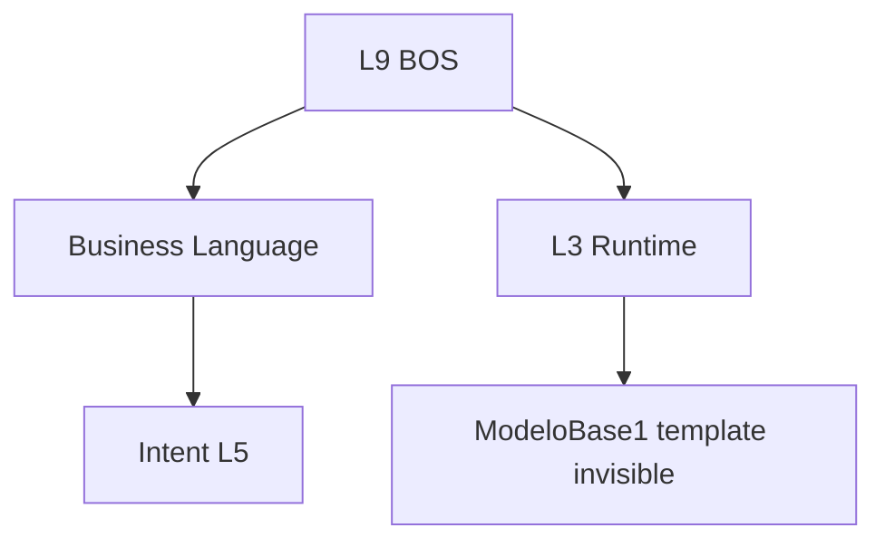

# 11 — Business Operating System (BOS)

**Status:** Official SSOT · **Version:** 1.0.0 · **Decision:** D-PA-10

---

## Review conclusion

**BOS remains valid and necessary** as L9 primary experience. **No architectural conflict** with MMM, Studio, or Runtime.

| Question | Answer |
|----------|--------|
| Still makes sense? | **Yes** — D-074 product identity |
| Overlap with Studio? | **No** — BOS = business user; Studio = expert |
| Overlap with module menu? | Module menu is **legacy UX**, not identity |
| What changes? | BOS becomes **CRB-aware** for capabilities/assets; module routes remain Runtime projections |

---

## Architecture placement

---

## BOS regions (frozen)

| Region | Content |
|--------|---------|
| Home | Objectives, capabilities, health |
| Assets | Business Asset registry |
| Operations | Task queues, cadastro entry points |
| Authoring | Business Language wizards |
| Intelligence | Recommendations (approval-gated) |
| Expert entry | Link to Studio (gated) |

---

## Overlap resolution

| Overlap area | Resolution |
|--------------|------------|
| BOS vs Intelligence home | BOS hosts widgets; L10 provides data |
| BOS vs Workflow tasks | BOS displays queue; Workflow Engine owns state |
| BOS vs Studio | Expert Mode boundary doc enforced |
| BOS vs ERP modules | Modules = Runtime routes, not home |

---

## Implementation alignment

| Item | Target |
|------|--------|
| Default route `/` | BOS home ✅ |
| Capability nav | From CRB menu + application objects |
| Asset registry | MMM business_object + computed_field assets |
| Legacy module sidebar | Hidden from home; reachable via Operations |

---

*End of document.*
