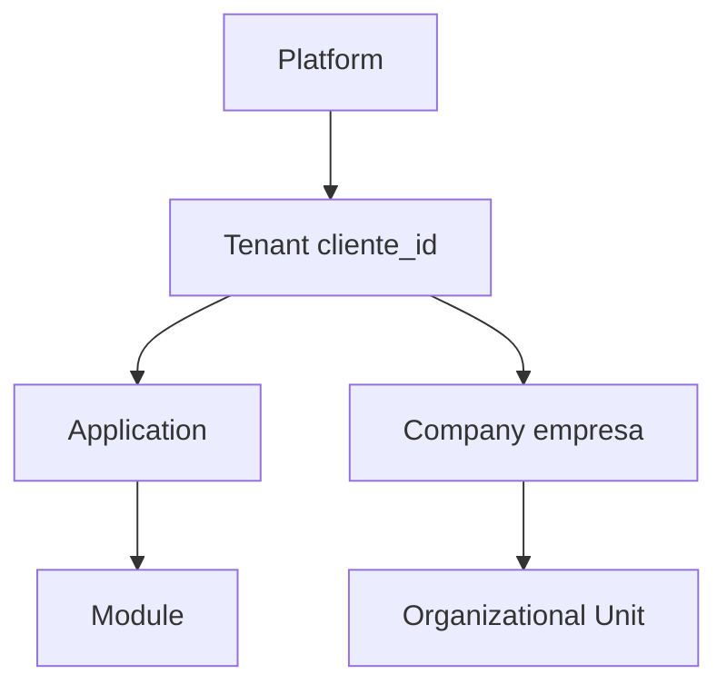

# 13 — Security Architecture

**Status:** Official SSOT · **Version:** 1.0.0 · **Decision:** D-PA-12

---

## Isolation hierarchy

Every query **must** include tenant scope. Cross-tenant access **fail-closed**.

---

## Identity & roles

| Concept | MMM object | Legacy |
|---------|------------|--------|
| User | L1 `Usuario` | ✅ |
| Role | `role` | `UsuarioPerfil` transitional |
| Permission | `permission` | RBAC tables |
| Group | `group` (future) | — |

Target: full MMM permission model (Foundation D).

---

## Policies

| Policy type | Enforcement |
|-------------|-------------|
| RBAC | RT-5 |
| ABAC attributes | company, OU on AccessScope |
| Field-level | V14 field permission flags |
| Row-level | GR adapter filters |
| Plan limits | L1 feature flags |

---

## Audit

| Event | Store |
|-------|-------|
| Auth | audit log |
| MMM mutate | `mmm_object_audit` |
| Record CRUD | `AuditLog` |
| Publish | `mmm_publish_log` |
| Admin | immutable append-only |

Retention per [Compliance Fortress](../engineering/PROGRAM-3.24-COMPLIANCE-RETENTION-AUDIT-FORTRESS-REPORT.md).

---

## LGPD

| Requirement | Implementation |
|-------------|----------------|
| Data minimization | Field policies |
| Consent | consent object (Group A) |
| Export | data subject export action |
| Expunge | lifecycle Program 3.25 pipeline |
| DPO audit | Compliance reports L10 |

---

## Storage & encryption

| Data | At rest | In transit |
|------|---------|------------|
| PostgreSQL | Provider encryption | TLS |
| Attachments | Supabase/S3 SSE | TLS |
| Secrets | Env/vault | Never in CRB |
| CRB signature | HMAC SHA-256 | TLS |

---

## Keys

| Key | Purpose |
|-----|---------|
| JWT_SECRET | Auth tokens |
| MMM_SIGNING_KEY | CRB signature |
| Marketplace publisher key | Package sign |
| Supabase keys | Storage |

Rotation: documented runbook — no architecture change.

---

*End of document.*
