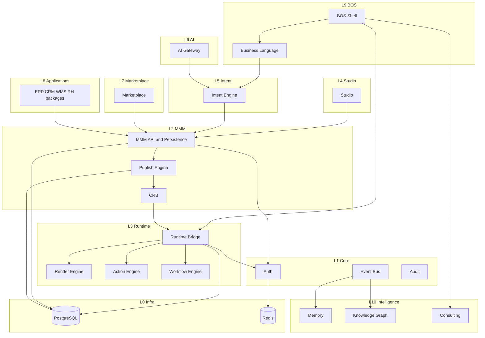

# 17 — Dependency Graph

**Status:** Official SSOT · **Version:** 1.0.0

---

## Full platform dependency graph



---

## Initialization order (cold start)

| Order | Component |
|-------|-----------|
| 1 | L0 Infrastructure |
| 2 | L1 Auth, Event Bus |
| 3 | L2 MMM persistence available |
| 4 | L2 Publish / pin resolution |
| 5 | L3 Runtime Bridge hydrate |
| 6 | L9 BOS shell mount |
| 7 | L4 Studio (on demand) |
| 8 | L5/L6 on user action |
| 9 | L10 subscribers active |

---

## Publish chain

```
Studio/Intent → MMM objects (approved) → Publish Engine → CRB → EnvironmentPin → Runtime hydrate
```

---

## Forbidden dependencies (never)

| From | Must NOT depend on |
|------|-------------------|
| L3 Runtime | L4 Studio, L9 BOS UI |
| L2 MMM | L9 BOS, L10 Intelligence |
| L1 Core | L3 Runtime UI |
| CRB consumer | MMM draft API |
| L10 Intelligence | Direct MMM write API |
| AI Gateway | Direct publish pin |

---

## Consumer matrix

| Producer | Consumers |
|----------|-----------|
| CRB | Runtime only |
| MMM API | Studio, Intent, Publish, Marketplace install |
| Event Bus | Workflow, Automation, L10, Audit |
| Generic Repository | Runtime actions only |
| EnvironmentPin | Runtime, Publish rollback |

---

*End of document.*
