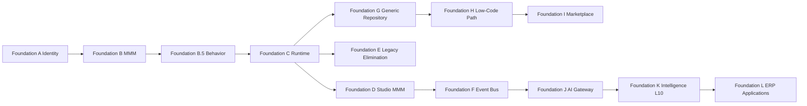

# 18 — Foundation Roadmap

**Status:** Official SSOT · **Version:** 1.0.0 · **Decision:** D-PA-19

---

## Purpose

Replace program-number roadmap with **Foundation sequence** — the only authorized order to resume implementation after architecture freeze.

---

## Foundation sequence

---

## Foundation definitions

| ID | Name | Scope | Gate | Status |
|----|------|-------|------|--------|
| **A** | Identity & Constitution | D-074, Constitution, BOS architecture | G-identity | ✅ **PASS** |
| **B** | Universal Meta Model | Spec, persistence, publish 4.01–4.04 | G421, G422 | ✅ **PASS** |
| **B.5** | Platform Behavior | Lifecycles, USM, events, errors, execution | G420B | ✅ **PASS** (docs) |
| **C** | Universal Runtime | RT-0→RT-8, CRB hydrate, Render/Action/Workflow | G423 | ⏳ **NEXT** |
| **D** | Studio MMM-native | 17 designers → MMM API | G424 | ⏳ Blocked on C partial |
| **E** | Legacy Elimination | Boot cache, MDP routes, generator, UsuarioPerfil | G425 | ⏳ Blocked on C |
| **F** | Event Bus L1 | Domain event transport DB-backed | G426 | ⏳ Blocked on C |
| **G** | Generic Repository | EAV + adapters unified API | G427 | ⏳ Blocked on C |
| **H** | Low-Code Certification | First zero-code module end-to-end | G428 | ⏳ Blocked on D,G |
| **I** | Marketplace v1 | .makpkg install/publish | G429 | ⏳ Blocked on B,C |
| **J** | AI Gateway | AICandidate pipeline production | G430 | ⏳ Blocked on F,D |
| **K** | Intelligence L10 | Event-driven Memory/KG/etc. | G431 | ⏳ Blocked on F |
| **L** | ERP as Application | Financeiro, Vendas packages | G432 | ⏳ Blocked on H |

---

## Foundation C deliverables (next authorized work)

**Prerequisite:** Foundation B.5 audit PASS — [25-AUDIT-FINAL.md](../platform-behavior/25-AUDIT-FINAL.md).

| Deliverable | Maps from |
|-------------|-----------|
| Runtime Bridge v2 universal | meta-model 4.05 |
| CRB loader + signature verify RT-2 | 02-RUNTIME |
| Registry hydration RT-3 | 02-RUNTIME |
| Render Engine adapters | 07-RENDER-ENGINE |
| Action dispatcher | 08-ACTION-ENGINE |
| Workflow instance host | 09-WORKFLOW-ENGINE |
| EnvironmentPin consumer | 4.05 |

**No Studio, Marketplace, or ERP work until Foundation C gate PASS.**

---

## Certification gates (planned)

| Gate | Validates |
|------|-----------|
| G423 | Runtime RT-1→RT-8 integration |
| G424 | Studio designer → MMM roundtrip |
| G425 | Zero boot cache SSOT paths |
| G426 | Event bus tenant isolation |
| G427 | GR CRUD via CRB field configs |
| G428 | Zero-code module publish→run |
| G429 | Marketplace install→publish |
| G430 | AI AICandidate→MMM batch |
| G431 | L10 event ingestion |
| G432 | ERP application package |

Register in GATE-REGISTRY when Foundation C starts.

---

## Mapping from MMM Program 4.xx

| Program | Foundation |
|---------|------------|
| 4.01–4.04 | B ✅ |
| B.5 | B.5 ✅ |
| 4.05 | C |
| 4.06 | G |
| 4.07 | C + D (permissions) |
| 4.08–4.10 | D |
| 4.11 | F |
| 4.12 | I |
| 4.13 | J |
| 4.14 | E |
| 4.15 | H |
| 4.16+ | L |

---

*End of document.*
