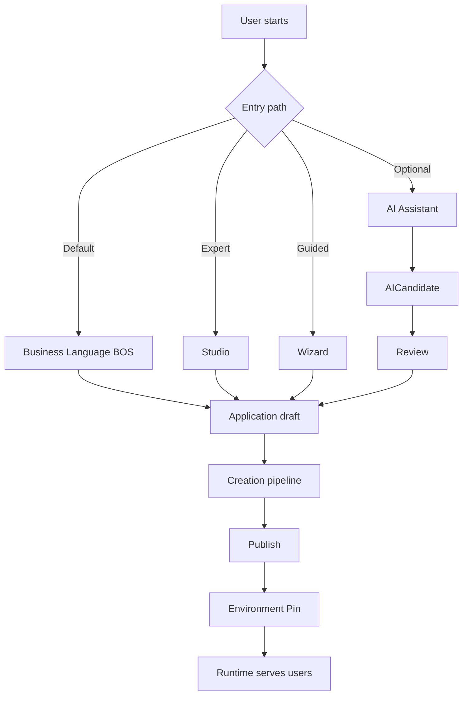
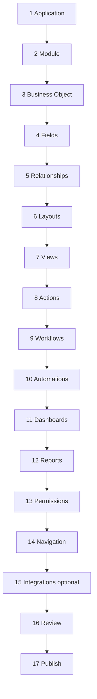

# 01 — Universal Authoring Overview

**Status:** Official SSOT · **Version:** 1.0.0 · **Decision:** D-UA-03

---

## How a solution is born

A **solution** = one **Application** graph (modules, BOs, UI, processes, permissions) published to CRB and pinned for a tenant.

---

## Starting from zero

| Step | Actor | Output |
|------|-------|--------|
| 1 | Tenant admin | Empty tenant or template install |
| 2 | Author | Choose wizard or manual Application create |
| 3 | Author | Follow creation order below |
| 4 | Reviewer | Approve scope |
| 5 | Publisher | Publish → CRB |
| 6 | Admin | Pin staging → validate → pin production |

**No code at any step.**

---

## Mandatory creation order

| # | Artifact | MMM objectTypes | Depends on |
|---|----------|-----------------|------------|
| 1 | Application | `application` | — |
| 2 | Module | `module` | Application |
| 3 | Business Object | `business_object` | Module |
| 4 | Fields | `field` | Business Object |
| 5 | Relationships | `relationship` | Business Objects |
| 6 | Layouts | `layout`, `section`, `panel` | Module, Fields |
| 7 | Views | `view`, `form` | Layout, BO |
| 8 | Actions | `action` | BO, Views |
| 9 | Workflows | `workflow`, `workflow_step` | BO, Actions |
| 10 | Automations | `automation`, `trigger` | Events, Actions |
| 11 | Dashboards | `dashboard`, `widget` | Queries, BOs |
| 12 | Reports | `report`, `query` | BOs, Fields |
| 13 | Permissions | `role`, `permission` | Module |
| 14 | Navigation | `menu`, `route` | Module, Layouts |
| 15 | Integrations | `integration`, `connector` | Module (optional) |
| 16 | Review | USM transitions | All above in scope |
| 17 | Publish | Publish Engine | `approved` scope |

---

## Parallel work allowed

| After step | May parallelize |
|------------|-----------------|
| 3 BOs defined | Multiple BOs + fields teams |
| 6 Layouts | Views, actions per screen |
| 9 Workflows | Dashboards, reports |

**Cannot parallelize:** Module before Application; Field before BO; Publish before Review.

---

## System examples (same order)

| System | Application code | First modules |
|--------|------------------|---------------|
| ERP | `erp` | financeiro, estoque, compras |
| CRM | `crm` | vendas, marketing |
| RH | `rh` | pessoas, folha |
| WMS | `wms` | warehouse, logistics |

Detail: [05-UNIVERSAL-WIZARDS.md](./05-UNIVERSAL-WIZARDS.md), [17-UNIVERSAL-APPLICATION-BUILDER.md](./17-UNIVERSAL-APPLICATION-BUILDER.md).

---

*End of document.*
