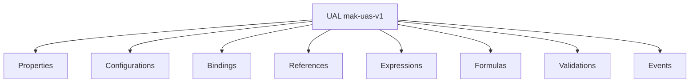

# 02 — Universal Authoring Language (UAL)

**Status:** Official SSOT · **Version:** 1.0.0 · **Decision:** D-UA-04

---

## Definition

**Universal Authoring Language (UAL)** — declarative configuration language for all MMM payloads. **Not programming.**

Version: **`mak-uas-v1`**

---

## Language constructs



---

## Properties

Key-value pairs on MMM envelope payload. Typed per PlatformSchema.

```yaml
code: empresa
label: { "pt-BR": "Empresa" }
required: true
sortOrder: 10
```

See [03-UNIVERSAL-PROPERTY-SYSTEM.md](./03-UNIVERSAL-PROPERTY-SYSTEM.md).

---

## Configurations

Structured nested objects — view mode, workflow step type, connector protocol.

```yaml
viewConfig:
  mode: table
  pageSize: 25
  sort: [{ field: nome, dir: asc }]
```

---

## Bindings

Links between artifacts:

| Binding | Syntax | Doc |
|---------|--------|-----|
| Data | `bind.data.fieldRef` | 10 |
| Action | `bind.action.actionRef` | 11 |
| Event | `bind.event.on` | 12 |
| Workflow | `bind.workflow.workflowRef` | 13 |
| API | `bind.integration.connectorRef` | 14 |

---

## References

Stable refs — never inline duplicates:

| Ref type | Format |
|----------|--------|
| Object | `{ "$ref": "mmm://object/{objectId}" }` |
| Code | `{ "$ref": "code://module/{moduleCode}/bo/{boCode}" }` |
| Field | `{ "$ref": "code://.../field/{fieldCode}" }` |

Resolved at publish compile (C-5).

---

## Expressions

Conditional values — [09-UNIVERSAL-EXPRESSIONS.md](./09-UNIVERSAL-EXPRESSIONS.md).

```
IF(status = 'active', true, false)
```

---

## Formulas

Computed values — [07-UNIVERSAL-FORMULA-LANGUAGE.md](./07-UNIVERSAL-FORMULA-LANGUAGE.md).

```
CONCAT(nome, ' - ', codigo)
SUM(itens.valor)
```

---

## Validations

Rules — [08-UNIVERSAL-VALIDATION-LANGUAGE.md](./08-UNIVERSAL-VALIDATION-LANGUAGE.md).

```
REQUIRED(cnpj)
MATCH(cnpj, REGEX_CNPJ)
IF(tipo = 'PJ', REQUIRED(cnpj), TRUE)
```

---

## Events

Authoring-time event wiring:

```yaml
on:
  record.saved: { actionRef: refresh_list }
  workflow.finished: { automationRef: notify_manager }
```

---

## What UAL is NOT

| Forbidden | Reason |
|-----------|--------|
| JavaScript | D-UA-02 |
| SQL | Injection / bypass GR |
| HTML/CSS raw | Theme tokens only |
| Direct CRB edit | D-UA-27 |
| Direct Record write | Runtime only |

---

*End of document.*
