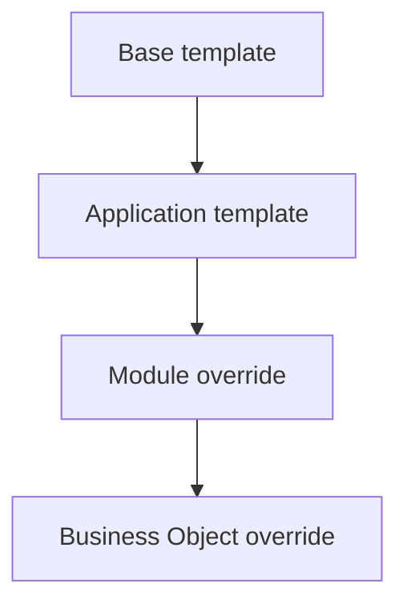

# 03 — Universal Property System

**Status:** Official SSOT · **Version:** 1.0.0 · **Decision:** D-UA-05

---

## Property layers

| Layer | Source |
|-------|--------|
| Schema | PlatformSchema required/optional |
| Type default | objectType template |
| Template | extendsRef inheritance |
| Author edit | Designer payload |
| Profile override | localization, theme |

---

## Required vs optional

| Class | Rule |
|-------|------|
| Required | Publish blocked if missing (C-5) |
| Optional | Default applied if absent |
| Conditional | Required when expression true |

---

## Inheritance

| Mechanism | Field |
|-----------|-------|
| extendsRef | Parent template objectId |
| override | Partial payload merge at compile |
| inherit | `true` = accept parent value |

Child wins on conflict unless `inherit: true` on child field.

---

## Defaults

| Default source | Precedence |
|----------------|------------|
| PlatformSchema | Lowest |
| Template | Medium |
| Designer explicit | Highest |

System defaults never require author input for optional fields.

---

## Profiles

| Profile | Purpose |
|---------|---------|
| `label` | i18n strings |
| `validation` | Rule sets |
| `visibility` | Expression-gated |
| `permission` | Field-level flags |
| `theme` | style_token refs |

Profiles attach via property path — not separate objects (D-UA-24).

---

## Property validation at authoring

| Stage | Check |
|-------|-------|
| Inline edit | PlatformSchema AJV |
| Save | Revision + schema |
| Publish | Full graph + refs |

---

*End of document.*
