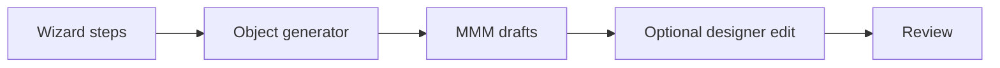

# 05 — Universal Wizards

**Status:** Official SSOT · **Version:** 1.0.0 · **Decision:** D-UA-07, D-UA-28

---

## Wizard model

Wizards are **guided UAS flows** that emit MMM object graphs at `draft` status.

---

## Wizard catalog

| Wizard | Creates | Steps (summary) |
|--------|---------|-----------------|
| **Criar ERP** | erp application + core modules | App → Finance → Inventory → Fiscal → Permissions |
| **Criar CRM** | crm application | App → Sales → Pipeline BOs → Kanban views |
| **Criar RH** | rh application | App → Employee → Leave → Payroll stubs |
| **Criar Financeiro** | financeiro module | BOs: AP, AR, ledger → workflows |
| **Criar Estoque** | estoque module | Product, movement, location |
| **Criar Processo** | workflow package | Workflow + steps + approvals |
| **Criar API** | integration | Connector → endpoints → mapping |
| **Criar Dashboard** | dashboard | Widgets → queries → layout |
| **Criar Workflow** | workflow | Trigger → steps → approvers |
| **Criar Automação** | automation | Event → condition → action |
| **Criar Aplicativo** | empty application | App shell → author adds modules |

---

## Wizard rules

| Rule | Detail |
|------|--------|
| WZ-01 | Output always `draft` |
| WZ-02 | Re-run on existing → fork new branch (D-UA-28) |
| WZ-03 | Template-based — uses [16-UNIVERSAL-TEMPLATE-SYSTEM.md](./16-UNIVERSAL-TEMPLATE-SYSTEM.md) |
| WZ-04 | User confirms each step — no silent create |
| WZ-05 | Wizard skippable — manual path equivalent ([23-MANUAL-AUTHORING.md](./23-MANUAL-AUTHORING.md)) |

---

## ERP wizard detail

| Step | Objects created |
|------|-----------------|
| 1 | `application` erp |
| 2 | modules: financeiro, compras, estoque, fiscal |
| 3 | BOs per module from template |
| 4 | Standard fields (code, name, status) |
| 5 | List + form views |
| 6 | save/delete actions |
| 7 | Optional approval workflows |
| 8 | Admin + user roles |

Author may delete/customize any generated object before review.

---

*End of document.*
