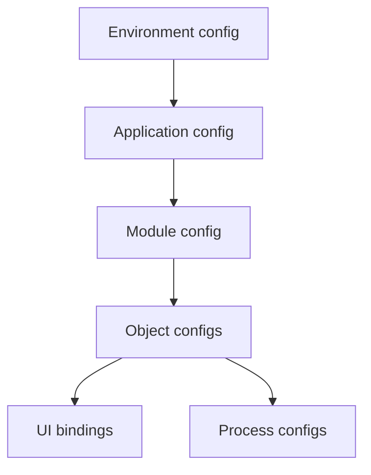

# 06 — Universal Configuration System

**Status:** Official SSOT · **Version:** 1.0.0 · **Decision:** D-UA-02

---

## Principle

**Everything is configuration.** MMM envelopes + UAL payloads. No encoded business logic in application code.

---

## Configuration stack

---

## Configuration types

| Type | Storage | Example |
|------|---------|---------|
| Structural | MMM object | business_object, field |
| Presentational | MMM layout/view | table columns |
| Behavioral | MMM action/workflow | save, approve |
| Integration | MMM connector | REST endpoint |
| Security | MMM role/permission | empresa:update |
| Visual | MMM theme | primary color token |

---

## Not configuration (exceptions)

| Exception | Allowed when |
|-----------|--------------|
| Signed plugin | Integration manifest in CRB |
| Platform core | L1 — frozen |
| Formula UFL | Declarative — not Turing-complete |

---

## Configuration UI surfaces

| Surface | User |
|---------|------|
| BOS Business Language | Business author |
| Studio designers | Expert |
| Wizards | Guided author |
| JSON import | Migration expert |

All produce identical MMM envelope shape.

---

## Compile path

Configuration → MMM `approved` → Publish C-1→C-16 → CRB → Runtime.

Authors **never** edit CRB or generated JS ([D-UA-27](../platform-authoring/DECISIONS.md)).

---

*End of document.*
