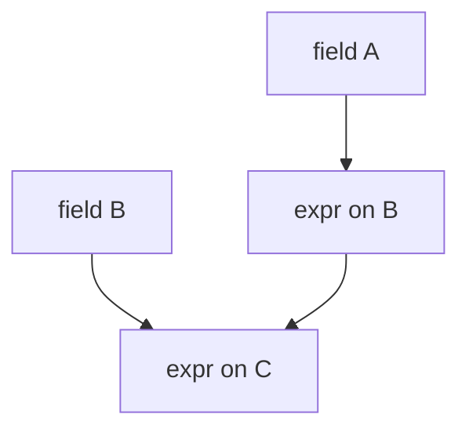

# 09 — Universal Expressions

**Status:** Official SSOT · **Version:** 1.0.0 · **Decision:** D-UA-10

---

## Expression engine

Expressions control **conditional** properties: visibility, required, enabled, default values.

Subset of UFL — returns boolean or scalar.

---

## Dependency resolution



| Rule | Detail |
|------|--------|
| EXP-01 | Acyclic dependency graph |
| EXP-02 | Cycles rejected at publish |
| EXP-03 | Re-evaluate on field change at Runtime |

---

## Common patterns

```
VISIBLE(role = 'admin')
ENABLED(status = 'draft')
REQUIRED(tipoPessoa = 'PJ')
DEFAULT(IF(isNew, TODAY(), DATA(dataCadastro)))
```

---

## Evaluation context

Same as UFL — current record + UEC (user role, tenant plan).

---

## Storage

Expressions stored as UAL strings on property paths:

```yaml
visibility:
  expression: "VISIBLE(acesso_global = true OR permissao.edit = true)"
```

---

*End of document.*
