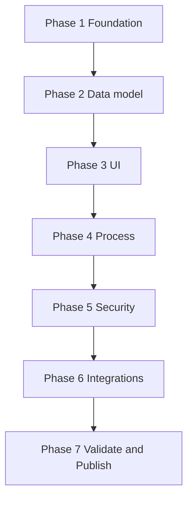

# 17 — Universal Application Builder

**Status:** Official SSOT · **Version:** 1.0.0

---

## Objective

Build a **complete application** using configuration only — manual or wizard.

---

## Builder phases

| Phase | Artifacts |
|-------|-----------|
| 1 Foundation | application, modules |
| 2 Data model | BOs, fields, relationships |
| 3 UI | layouts, views, navigation |
| 4 Process | actions, workflows, automations |
| 5 Security | roles, permissions |
| 6 Integrations | connectors (optional) |
| 7 Publish | review, publish, pin |

---

## Checklist (minimum viable app)

| Item | Required |
|------|----------|
| ≥1 module | Yes |
| ≥1 BO | Yes |
| ≥1 field per BO | Yes |
| list + form view | Yes |
| save action | Yes |
| ≥1 role + permissions | Yes |
| menu route | Yes |
| publish to staging | Yes |

---

## Validation gate

**Application Readiness Score** — automated pre-publish check:

| Check | Weight |
|-------|--------|
| Orphan BOs | fail |
| Unbound views | fail |
| Actions without permission | warn |
| Missing navigation | fail |
| Circular refs | fail |

---

## Output

Published CRB → tenant pin → BOS shows application home.

---

*End of document.*
