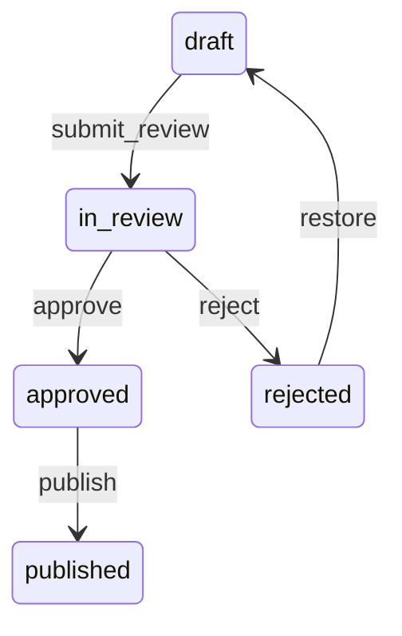

# 18 — Universal Review System

**Status:** Official SSOT · **Version:** 1.0.0 · **Decision:** D-UA-14

---

## Review flow (USM)

Behavior: [platform-behavior/16-UNIVERSAL-STATE-MACHINE.md](../platform-behavior/16-UNIVERSAL-STATE-MACHINE.md).

---

## Review scope

| Scope type | Contents |
|------------|----------|
| Object | Single MMM object |
| Module | All objects in module |
| Application | Full application graph |
| Publish batch | Approved set for compile |

---

## Reviewer UI (future)

| Feature | Function |
|---------|----------|
| Diff view | Changes since last approved |
| Dependency impact | Downstream refs |
| Comment | Thread on object |
| Approve/reject | USM transition |
| Checklist | Automated validation results |

---

## Rules

| Rule | Detail |
|------|--------|
| REV-01 | Author ≠ sole approver (4-eyes for production) |
| REV-02 | Reject requires comment |
| REV-03 | Publish only from `approved` |

---

*End of document.*
