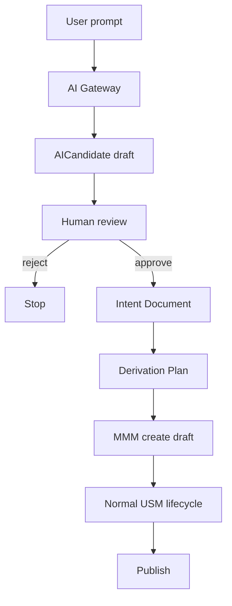

# 22 — AI Authoring

**Status:** Official SSOT · **Version:** 1.0.0 · **Decision:** D-UA-18

---

## Rule

**AI never creates MMM objects directly.**

---

## Mandatory flow

Cross-ref: [platform-behavior/11-AI-LIFECYCLE.md](../platform-behavior/11-AI-LIFECYCLE.md), [platform-protocol/05](../platform-protocol/05-UNIVERSAL-COMMAND.md) (ai.candidate.create only).

---

## AI Assistant scope (authoring)

| Allowed | Forbidden |
|---------|-----------|
| Suggest field lists | Direct PATCH MMM |
| Propose workflow | Auto-approve |
| Generate AICandidate | Publish |
| Explain UAL | Set permissions |
| Fill wizard answers | Pin environment |

---

## Plan gates

| Plan | AI authoring |
|------|--------------|
| Free | None |
| Business | Suggestions only |
| Enterprise | + Intent assist |
| Platform | Full candidate pipeline |

---

## Coexistence with manual

AI output always lands in **draft** — author may edit in any designer before review.

---

*End of document.*
