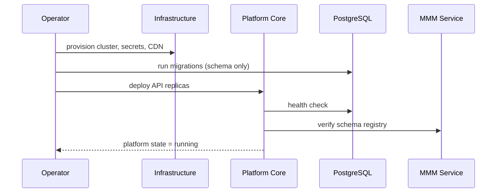
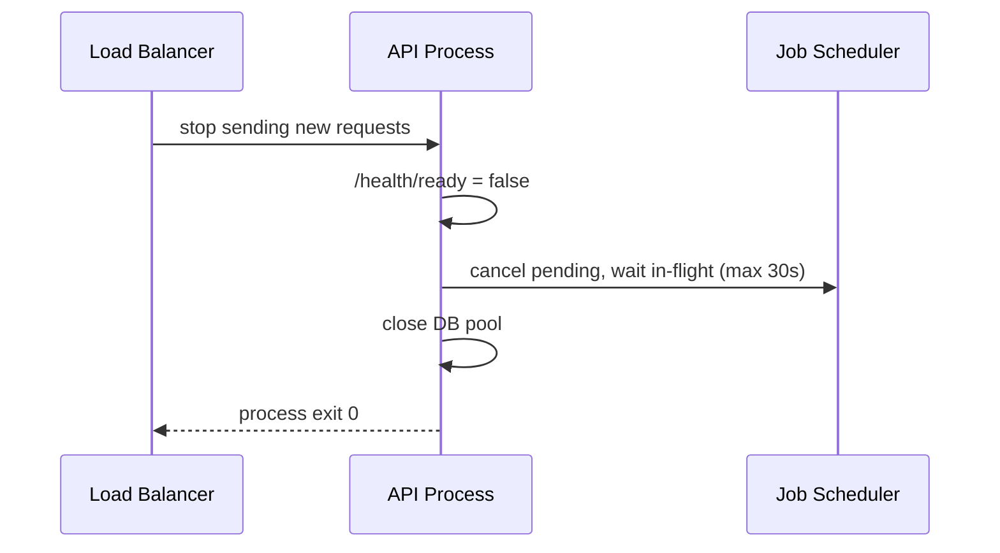
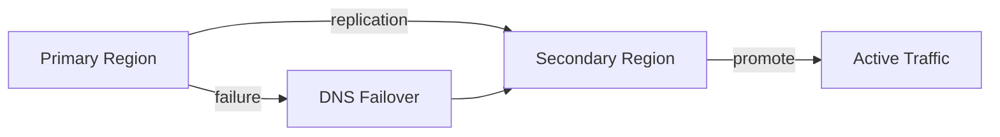

# 01 — Platform Lifecycle

**Status:** Official SSOT · **Version:** 1.0.0 · **Decision:** D-PB-29, D-PB-24

---

## Scope

Platform-level operational behavior: birth, boot, shutdown, update, rollback, recovery, failover — **not** tenant or application lifecycle.

---

## Birth (initial deploy)

| Step | Behavior |
|------|----------|
| Provision | L0: DB, Redis, object storage, TLS certs |
| Migrate | Schema migrations only — no tenant data |
| Seed | Platform bootstrap objects (if any) at `running` |
| Verify | Health endpoints all green |

---

## Initialize (process start)

| Order | Component | Behavior |
|-------|-----------|----------|
| 1 | Config load | Env validation — fail-fast on missing secrets |
| 2 | DB pool | Connect with retry (3×, 2s backoff) |
| 3 | Redis | Connect optional-degraded (cache miss → DB) |
| 4 | Event bus | L1 subscriber registration |
| 5 | Job scheduler | Register cron handlers |
| 6 | MMM schema registry | Load AJV schemas to memory |
| 7 | Ready | Accept traffic on `/health/ready` |

**Rule:** Not ready until step 7 complete (D-PB-29).

---

## Boot (accept traffic)

| Phase | Behavior |
|-------|----------|
| Warmup | Pre-load platform CRB if pinned |
| Listener | HTTP on configured port |
| Graceful queue | Existing connections drain on shutdown |

---

## Shutdown

| Step | Timeout | Behavior |
|------|---------|----------|
| Stop accept | 0 | `/health/ready` → 503 |
| Drain requests | 30s | In-flight complete |
| Stop jobs | 30s | Idempotent checkpoint |
| Close connections | 5s | Pool drain |

Forced kill (SIGKILL): in-flight transactions roll back; jobs retry on next boot.

---

## Restart

Same as shutdown → initialize. In-flight user sessions: refresh token valid → seamless; access token expired → re-auth.

---

## Update (platform version)

| Stage | Behavior |
|-------|----------|
| Pre-check | Gates, migration dry-run |
| Rolling deploy | One replica at a time; readiness probe |
| Migration | Forward-only; backward-compatible API |
| Post-verify | Smoke + health |

Breaking schema: blue-green with maintenance window.

---

## Rollback (platform)

| Type | Behavior |
|------|----------|
| Deploy rollback | Revert container image; DB rollback only if migration reversible |
| CRB rollback | N/A at platform level — tenant EnvironmentPin handles |
| Config rollback | Previous env revision |

---

## Recovery

| Scenario | Behavior |
|----------|----------|
| DB failure | Fail-closed; read replicas promote per runbook |
| Redis loss | Degraded mode — no cache, higher latency |
| Single replica crash | LB removes; auto-restart |
| Corrupt CRB | Reject load; alert ops; prior pin remains |

RPO: 1h (backup). RTO: 4h (enterprise SLA).

---

## Failover

| Trigger | Action |
|---------|--------|
| Region unhealthy 5m | Automated DNS failover |
| DB primary down | Promote replica |
| Split brain | Manual intervention — fail-closed |

---

## Platform USM profile

Platform deployment artifact uses **DEPLOYMENT** profile: `running` (live), `deprecated` (previous version), `archived` (decommissioned).

---

*End of document.*
