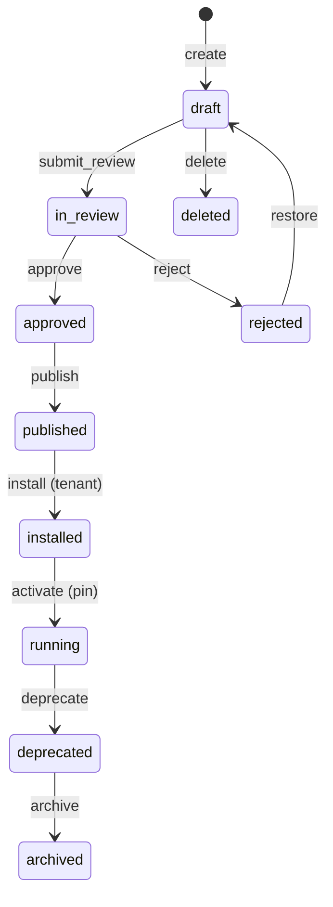

# 02 — Application Lifecycle

**Status:** Official SSOT · **Version:** 1.0.0 · **Decision:** D-PB-01, D-PB-08  
**Profile:** DEFINITION + DEPLOYMENT

---

## Application object

MMM `application` objectType — deployable product boundary (ERP, CRM, etc.).

Uses [16-UNIVERSAL-STATE-MACHINE.md](./16-UNIVERSAL-STATE-MACHINE.md) **DEFINITION** profile for authoring; **DEPLOYMENT** profile for tenant binding.

---

## State transitions

---

## Transition table

| From | Operation | To | Actor | Preconditions |
|------|-----------|-----|-------|---------------|
| — | `create` | draft | Studio / Intent | Tenant scope |
| draft | `edit` | draft | Author | Lock held |
| draft | `submit_review` | in_review | Author | Validation pass |
| in_review | `approve` | approved | Reviewer | Permission `application.approve` |
| in_review | `reject` | rejected | Reviewer | Comment required |
| approved | `publish` | published | Publish Engine | All deps published |
| published | `install` | installed | Tenant admin | Marketplace or manual |
| published/installed | `activate` | running | Environment Pin | CRB signed |
| running | `deprecate` | deprecated | Publish new version | New pin available |
| deprecated | `archive` | archived | Admin | No active pin |
| rejected/archived | `restore` | draft | Admin | — |
| draft/rejected | `delete` | deleted | Admin | No dependents |

---

## Side effects

| Transition | Events | Runtime |
|------------|--------|---------|
| `publish` | `application.published` | CRB includes app manifest |
| `activate` | `application.activated` | Routes registered in BOS |
| `deprecate` | `application.deprecated` | Read-only until pin change |
| `delete` | `application.deleted` | Removed from Studio catalog |

---

## Multi-tenant behavior

Each tenant may `install` same published application independently. Tenant A `running` does not affect Tenant B.

---

## Related

- Module lifecycle: [03-MODULE-LIFECYCLE.md](./03-MODULE-LIFECYCLE.md)
- Deployment path: [15-DEPLOYMENT-LIFECYCLE.md](./15-DEPLOYMENT-LIFECYCLE.md)

---

*End of document.*
