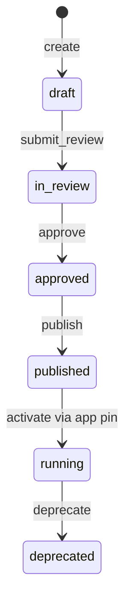

# 03 — Module Lifecycle

**Status:** Official SSOT · **Version:** 1.0.0 · **Profile:** DEFINITION

---

## Module object

MMM `module` — functional domain inside an Application (`empresas`, `financeiro`, etc.).

Inherits parent application DEPLOYMENT state when pinned; module DEFINITION lifecycle is independent.

---

## State transitions

Same USM DEFINITION path as Application — see [02-APPLICATION-LIFECYCLE.md](./02-APPLICATION-LIFECYCLE.md).

---

## Module-specific rules

| Rule | Behavior |
|------|----------|
| Parent dependency | Cannot `publish` if parent application not `published` |
| `module_dependency` | Dependent modules must be `published` before publish |
| Route registration | `running` only when CRB includes module routes |
| Legacy modules | Transitional boot cache — sunset Foundation E |

---

## Transition table (module-specific preconditions)

| Operation | Extra precondition |
|-----------|-------------------|
| `publish` | All referenced BOs, fields, layouts in `approved` or `published` |
| `activate` | Parent application `running` |
| `deprecate` | Dependent modules deprecated or repointed |
| `delete` | No `running` pin references module |

---

## Events

| Event | When |
|-------|------|
| `module.created` | `create` |
| `module.published` | `publish` |
| `module.activated` | pin includes module |
| `module.deprecated` | superseded |

---

*End of document.*
