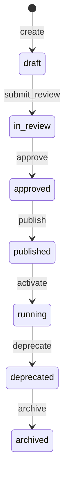

# 04 — Business Object Lifecycle

**Status:** Official SSOT · **Version:** 1.0.0 · **Profile:** DEFINITION

---

## Business Object

MMM `business_object` — entity definition (schema for records).

---

## State transitions

Full DEFINITION profile — identical transition table to [02-APPLICATION-LIFECYCLE.md](./02-APPLICATION-LIFECYCLE.md).

---

## BO-specific rules

| Rule | Behavior |
|------|----------|
| Field dependency | Cannot `publish` BO if required fields not `published` |
| Record impact | `deprecate` does not delete existing records |
| GR adapter | Created at first `running` pin |
| Computed fields | Derived assets follow same lifecycle |

---

## Publish side effects

| Action | Result |
|--------|--------|
| `publish` | BO entry in CRB V13 registry |
| `activate` | GR table/EAV mapping live |
| `deprecate` | New records blocked; existing readable |

---

## Events

`business_object.created`, `.published`, `.activated`, `.deprecated`, `.deleted`

---

*End of document.*
