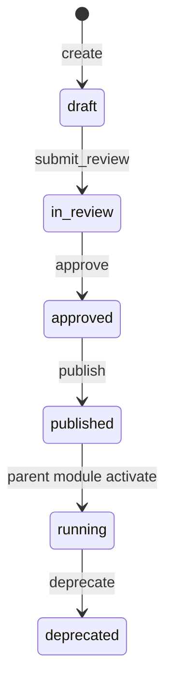

# 05 — Field Lifecycle

**Status:** Official SSOT · **Version:** 1.0.0 · **Profile:** DEFINITION (subset)

---

## Field object

MMM `field` — attribute definition on a BusinessObject.

---

## States used

`draft`, `in_review`, `approved`, `published`, `running` (via parent), `deprecated`, `archived`, `deleted`

**Skips:** `installed` — field activates with parent module pin.

---

## State transitions

---

## Field-specific rules

| Rule | Behavior |
|------|----------|
| Type change | Blocked after `published` — create new field + migrate |
| Required flag | Can change in `draft` only |
| Delete | Blocked if records exist — use `deprecate` |
| Validation rules | Compiled into CRB V14 at publish |

---

## Data impact

| Transition | Records |
|------------|---------|
| `publish` | New validation rules apply |
| `deprecate` | Field hidden in UI; data retained |
| `delete` | Only if zero records ever created |

---

*End of document.*
