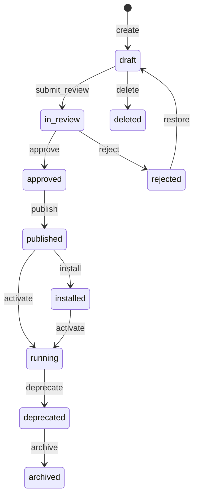
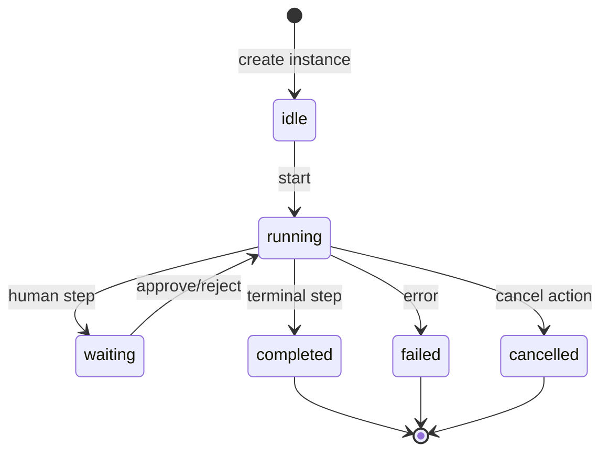

# 06 — Workflow Lifecycle

**Status:** Official SSOT · **Version:** 1.0.0 · **Profile:** DEFINITION + INSTANCE

---

## Two artifacts

| Artifact | Profile | Scope |
|----------|---------|-------|
| Workflow **definition** | DEFINITION | MMM `workflow` object |
| Workflow **instance** | INSTANCE | Runtime execution |

---

## Definition lifecycle

Full **DEFINITION** profile — same path as [04-BUSINESS-OBJECT-LIFECYCLE.md](./04-BUSINESS-OBJECT-LIFECYCLE.md).

| State | Studio | Runtime |
|-------|--------|---------|
| draft | Editable | Not loaded |
| in_review | Read-only for author | Not loaded |
| approved | Read-only | Not loaded |
| rejected | Restorable to draft | Not loaded |
| published | Read-only | Available for trigger |
| installed | — | Bound, not live |
| running | — | Active in CRB V20 |
| deprecated | Hidden | Existing instances complete; no new |
| deleted | Hidden | Audit only |

---

## Instance lifecycle (USM sub-states under `running`)

| Sub-state | Behavior |
|-----------|----------|
| idle | Created, not started |
| running | Active step executing |
| waiting | Awaiting human input |
| completed | Terminal success |
| failed | Terminal error — retry policy applies |
| cancelled | User/admin cancelled |

---

## Triggers

| Trigger | Behavior |
|---------|----------|
| Action Engine | `triggerWorkflow` on action |
| Record event | Automation rule |
| Timer | L1 scheduler |
| Manual | BOS Operations queue |

---

## Events

`workflow.started`, `workflow.step.entered`, `workflow.step.completed`, `workflow.finished`, `workflow.failed`, `workflow.cancelled`

---

*End of document.*
