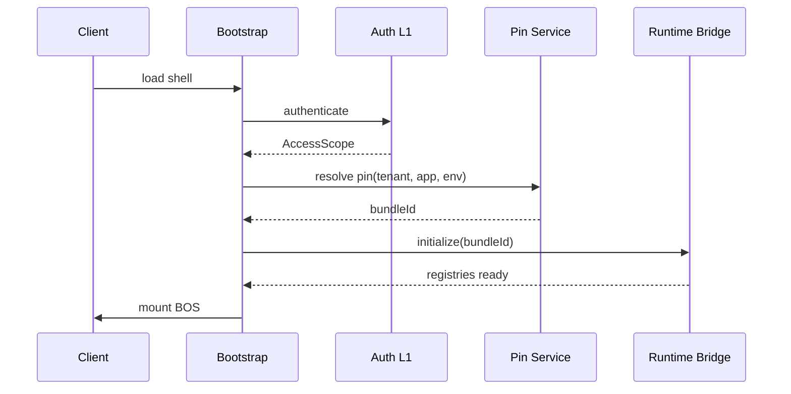

# 07 — Runtime Lifecycle (RT-0 → RT-8)

**Status:** Official SSOT · **Version:** 1.0.0 · **Decision:** D-PA-03, D-PB-30  
**Architecture ref:** [02-RUNTIME.md](../platform-architecture/02-RUNTIME.md)

---

## Overview

Runtime lifecycle is **per session** and **per request**, not a USM object. Phases RT-0 through RT-8 execute sequentially on each user session bootstrap and each routed request.

---

## RT-0 Bootstrap (session birth)

| Step | Input | Output | Failure |
|------|-------|--------|---------|
| Shell load | HTML/JS bundle | Bootstrap context | Maintenance page |
| Auth | JWT/cookie | AccessScope | Login redirect |
| Pin resolve | tenant+app+env | bundleId | Fail-closed maintenance |
| Bridge init | CRB ref | V13–V20 registries | Error MAK-L3-RUNTIME-002 |

---

## RT-1 Load Pin

| Behavior | Detail |
|----------|--------|
| Fetch | EnvironmentPin for scope |
| Cache | Redis key `pin:{tenant}:{app}:{env}` TTL 60s |
| Stale | Background refresh if >30s old |

---

## RT-2 Verify CRB

| Check | Fail behavior |
|-------|---------------|
| `crbVersion` = `mmm-crb-v1` | Reject load |
| `integrityHash` match | Reject load |
| `signatureRef` HMAC valid | Reject load + alert ops |
| Schema version compatible | Reject if mismatch |

---

## RT-3 Hydrate

| Registry | Source |
|----------|--------|
| V13 entities | CRB.entities |
| V14 fields | CRB.fields |
| V15 layouts | CRB.layouts |
| V16 validations | CRB.validations |
| V17 routes | CRB.routes |
| V18 permissions | CRB.permissions |
| V19 actions | CRB.actions |
| V20 workflows | CRB.workflows |

Circular dependency → abort (should be caught at publish).

Memory cache: session lifetime. Redis: TTL 300s, invalidated on publish.

---

## RT-4 Session bind

| Attribute | Source |
|-----------|--------|
| userId | Auth |
| tenantId | Auth |
| companyId | User selection |
| locale | User preference |
| traceId | Generated per session |

---

## RT-5 Authorize

| Check | Order |
|-------|-------|
| Tenant active | 1 — fail if suspended |
| Module permission | 2 |
| Action permission | 3 |
| Field-level | 4 |
| Row-level (GR) | 5 |

Fail-closed → `MAK-L1-SECURITY-003`.

---

## RT-6 Route

| Input | Output |
|-------|--------|
| URL path | route entry → layoutId → screen |

Unknown route → 404 BOS page.

---

## RT-7 Render

| Step | Behavior |
|------|----------|
| Select view adapter | From layout viewMode |
| Load data | GR list/get |
| Bind fields | V14 configs |
| Hydrate UI | Foundation + BaseTemplate |

---

## RT-8 Execute

| Handler | Trigger |
|---------|---------|
| Action Engine | Button/control |
| Workflow Engine | Action or event |
| Automation | Event rule |
| API integration | Action kind=integration |

See [23-UNIVERSAL-EXECUTION-MODEL.md](./23-UNIVERSAL-EXECUTION-MODEL.md).

---

## Session end

| Cause | Behavior |
|-------|----------|
| Logout | Clear tokens, invalidate refresh |
| Timeout | Access expired → refresh or re-login |
| Tab close | Server session TTL expires |
| Tenant suspend | Next request → maintenance |

---

## Runtime restart (CRB update)

Pin change → cache invalidate → next request re-runs RT-1→RT-3. Active screens: soft reload prompt.

---

*End of document.*
