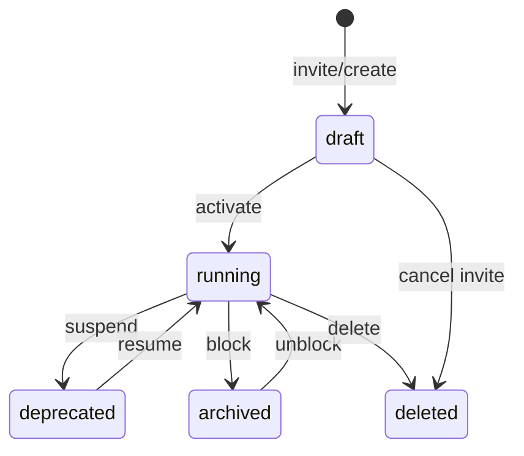

# 08 — User Lifecycle

**Status:** Official SSOT · **Version:** 1.0.0 · **Profile:** IDENTITY (D-PB-22)

---

## States

| USM state | User meaning |
|-----------|--------------|
| draft | Invited, not activated |
| running | Active user |
| deprecated | Suspended (temporary) |
| archived | Blocked |
| deleted | Soft deleted |

---

## Flow

---

## Transition table

| Operation | From → To | Actor | Side effects |
|-----------|-----------|-------|--------------|
| `create` | → draft | Admin | Send invite email |
| `activate` | draft → running | User / Admin | Set password, MFA |
| `suspend` | running → deprecated | Admin | Invalidate sessions |
| `resume` | deprecated → running | Admin | — |
| `block` | running → archived | Admin | Immediate session revoke |
| `unblock` | archived → running | Admin | — |
| `delete` | * → deleted | Admin | Anonymize PII per LGPD |

---

## Permissions lifecycle

| Event | Behavior |
|-------|----------|
| Role assign | Immediate — next RT-5 picks up |
| Role revoke | Immediate session permission refresh |
| Company access change | AccessScope rebuild |

Permissions are **not** USM objects — they mutate via MMM `permission`/`role` DEFINITION lifecycle.

---

## Events

`user.invited`, `user.activated`, `user.suspended`, `user.blocked`, `user.deleted`, `permission.granted`, `permission.revoked`

---

*End of document.*
