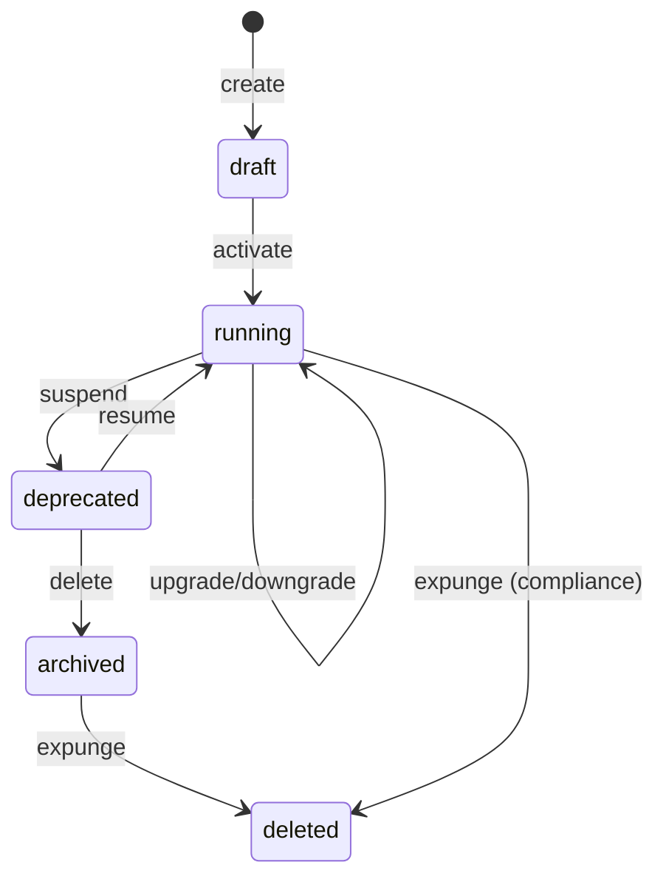

# 09 — Tenant Lifecycle

**Status:** Official SSOT · **Version:** 1.0.0 · **Profile:** IDENTITY · **Decision:** D-PB-15

---

## Tenant = `cliente`

Platform isolation boundary (D-PA-12).

---

## States

| USM state | Tenant meaning |
|-----------|----------------|
| draft | Provisioning |
| running | Active subscription |
| deprecated | Suspended |
| archived | Cancelled (retention) |
| deleted | Expunged |

---

## Flow

---

## Operations

| Operation | Alias | Behavior |
|-----------|-------|----------|
| `create` | — | Provision tenant, default admin user (draft) |
| `activate` | — | Enable billing, accept traffic |
| `upgrade` | — | Plan change — feature flags updated |
| `downgrade` | — | Plan change — graceful feature removal |
| `suspend` | — | Read-only 30d; Runtime maintenance screen |
| `resume` | — | Restore full access |
| `delete` | cancel | `deprecated` → `archived` — data retained per retention policy |
| `restore` | — | From backup to new draft tenant |
| `expunge` | — | Irreversible — D-PB-28 |

### Admin side effects (non-transition)

| Operation | Behavior |
|-----------|----------|
| `backup` | Snapshot MMM + DB slice — **not** a USM transition; emits `tenant.backup.completed` |

---

## Suspension behavior (D-PB-15)

| Component | Suspended tenant |
|-----------|------------------|
| Login | Allowed (read-only) |
| Record write | Blocked |
| MMM publish | Blocked |
| API | 403 except read |
| Background jobs | Paused |

---

## Events

`tenant.created`, `tenant.activated`, `tenant.suspended`, `tenant.cancelled`, `tenant.backup.completed`, `tenant.restored`

---

*End of document.*
