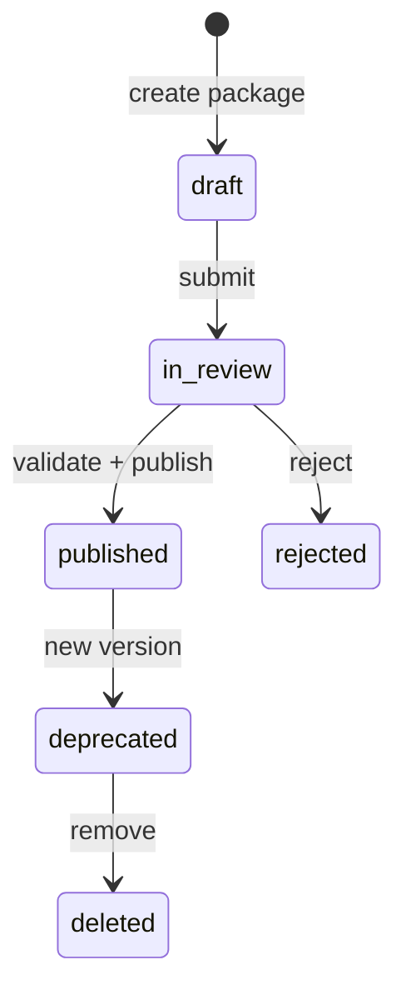

# 10 — Marketplace Lifecycle

**Status:** Official SSOT · **Version:** 1.0.0 · **Decision:** D-PB-23, D-PA-11

---

## Package lifecycle (publisher)

Profile: **PACKAGE**

---

## Tenant install lifecycle

| Step | USM transition | Behavior |
|------|----------------|----------|
| Browse | — | Read catalog |
| Purchase | — | License record created |
| Install | `published` → `installed` | Import `.makpkg` → MMM `draft` objects |
| Review | draft → in_review → approved | Tenant admin |
| Publish | approved → published | Tenant-scoped publish |
| Activate | → running | Environment pin |
| Update | new version install | Prior → deprecated |
| Rollback | pin rollback | D-PB-24 |
| Remove | uninstall | Objects → archived (not deleted) |

---

## Validation pipeline

| Stage | Checks |
|-------|--------|
| Signature | Publisher key valid |
| Schema | All envelopes pass AJV |
| Dependencies | Required packages present |
| License | Tenant entitled |
| Malware | Static scan |

Fail → reject with `MAK-L7-MARKETPLACE-001`.

---

## Events

`marketplace.package.published`, `marketplace.package.purchased`, `marketplace.package.installed`, `marketplace.package.updated`, `marketplace.package.rollback`, `marketplace.package.removed`

---

*End of document.*
