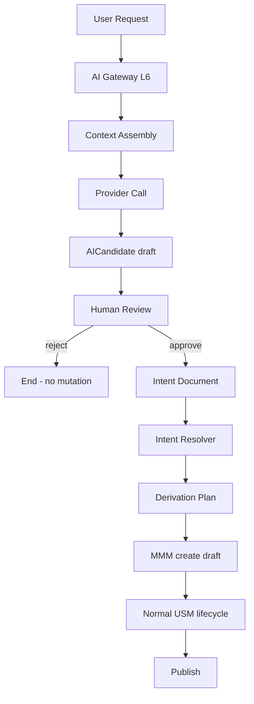

# 11 — AI Lifecycle

**Status:** Official SSOT · **Version:** 1.0.0 · **Decision:** D-PB-07, D-PA-09

---

## Rule

AI **never** writes MMM or Records directly. All outputs pass through human review.

---

## Flow

---

## Stage behavior

| Stage | State | Actor | Output |
|-------|-------|-------|--------|
| Solicitação | — | User | Prompt + scope |
| Intent | — | AI Gateway | Structured intent (optional) |
| Candidate | draft | AI | `ai_candidate` object |
| Review | in_review | Human | Approve/reject/edit |
| Approval | approved | Reviewer | Triggers derivation |
| Derivation | — | Resolver | DerivationPlan |
| MMM create | draft | Batch API | MMM envelopes |
| Publish | published | Normal pipeline | CRB |

---

## AICandidate object

| Field | Rule |
|-------|------|
| humanReviewRequired | Always `true` |
| status | USM `draft` until review |
| source | AI provider + model id |
| proposedChanges | Read-only preview |

---

## Plan gates

| Plan | AI lifecycle stages allowed |
|------|----------------------------|
| Free | None |
| Business | Request + Candidate (review only) |
| Enterprise | + Intent + Derivation assist |
| Platform | Full pipeline |

---

## Forbidden paths

| Path | Error |
|------|-------|
| AI → MMM POST | `MAK-L6-AI-001` |
| AI → Record write | `MAK-L6-AI-002` |
| Auto-approve Candidate | `MAK-L6-AI-003` |
| AI → Environment pin | `MAK-L6-AI-004` |

---

## Events

`ai.request.started`, `ai.candidate.created`, `ai.candidate.approved`, `ai.candidate.rejected`, `ai.derivation.completed`

---

*End of document.*
