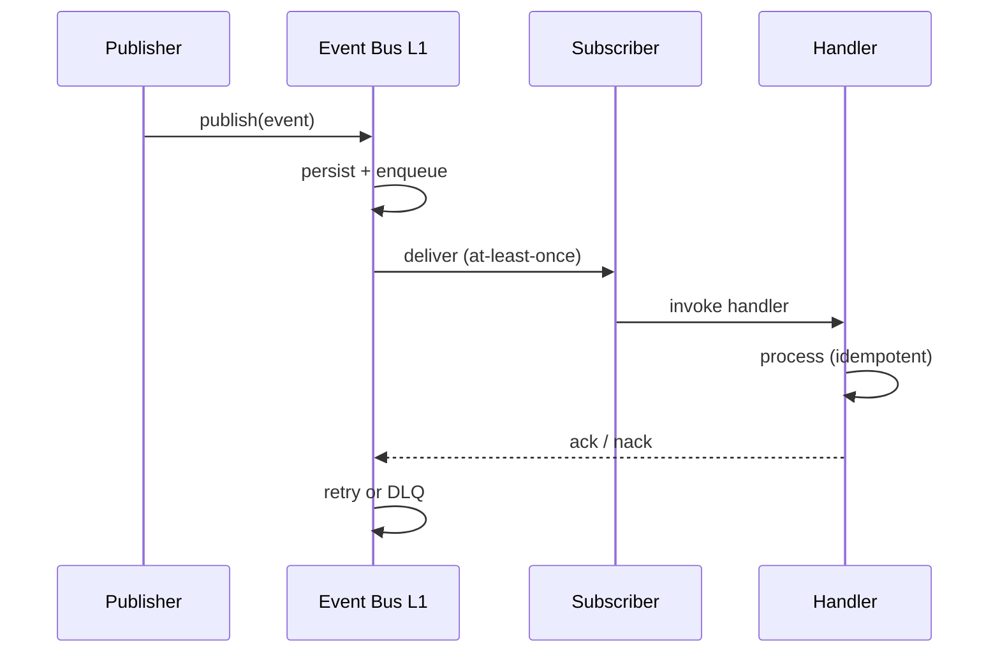

# 12 — Event Lifecycle

**Status:** Official SSOT · **Version:** 1.0.0 · **Decision:** D-PB-04, D-PB-25

---

## Event phases

---

## Publish behavior

| Rule | Detail |
|------|--------|
| Envelope | `{ eventId, type, tenantId, traceId, timestamp, payload, schemaVersion }` |
| Tenant scope | Mandatory — R-05 |
| Ordering | Per aggregate id — ordered |
| Durability | Persist before ack to publisher |

---

## Consume behavior

| Rule | Detail |
|------|--------|
| Registration | Declarative subscription manifest |
| Idempotency | `eventId` dedup table |
| Retry | 3× backoff — D-PB-19 |
| DLQ | Failed after retries |

---

## Respond behavior

| Pattern | Use |
|---------|-----|
| Sync callback | Request-response (rare) |
| Async event | Standard — emit follow-up event |
| Saga | Multi-step — compensating events |

Handlers **never** block publisher thread.

---

## Who publishes what

| Publisher | Events |
|-----------|--------|
| MMM API | `mmm.object.*`, `object.lifecycle.*` |
| Publish Engine | `mmm.publish.*` |
| Runtime | `runtime.*`, `action.*` |
| Workflow Engine | `workflow.*` |
| GR | `record.*` |
| Auth | `security.*` |
| Marketplace | `marketplace.*` |
| AI Gateway | `ai.*` |

Full catalog: [17-UNIVERSAL-EVENTS.md](./17-UNIVERSAL-EVENTS.md).

---

*End of document.*
