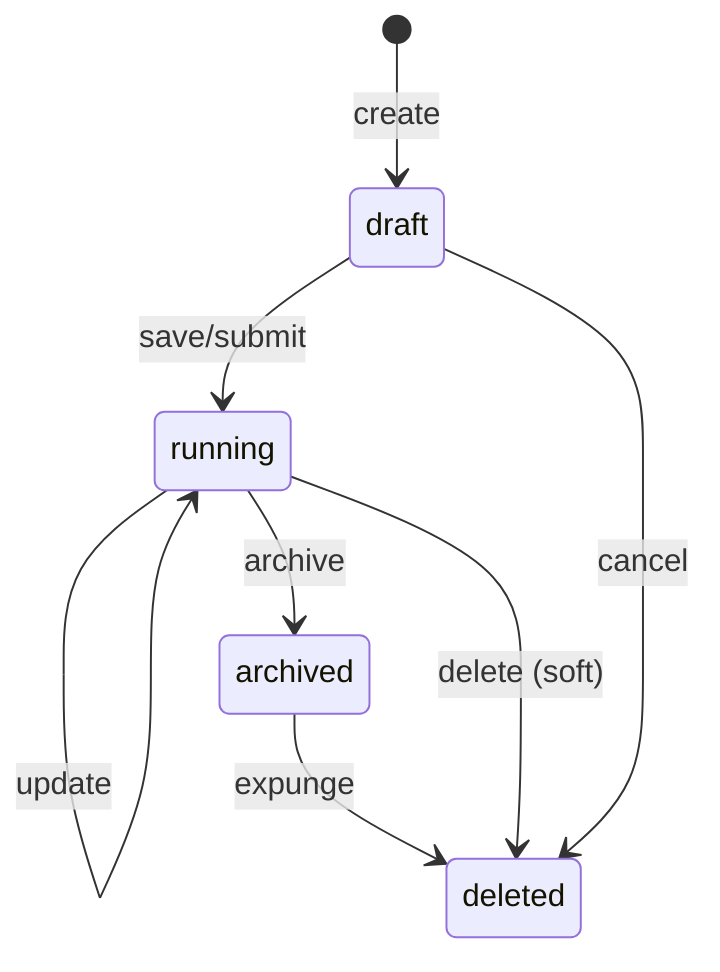

# 13 — Data Lifecycle

**Status:** Official SSOT · **Version:** 1.0.0 · **Profile:** DATA (D-PB-09)

---

## Planes

| Plane | Object | Profile |
|-------|--------|---------|
| Definition | MMM | DEFINITION |
| Data | Business Record | DATA |

---

## Record states

---

## CRUD behavior

| Operation | Preconditions | Events |
|-----------|---------------|--------|
| Create | BO `running`, RT-5 pass | `record.created` |
| Read | RT-5 + row-level filter | — |
| Update | Optimistic lock on version | `record.updated` |
| Delete | Policy: soft default | `record.deleted` |

Validation from CRB V14 + V16 — not hardcoded.

---

## Versioning

| Type | Mechanism |
|------|-----------|
| MMM object | `revision` + version table |
| Record | `rowVersion` optimistic lock |
| Optional history | BO policy — snapshot on update |

---

## Snapshot

| Scope | Trigger |
|-------|---------|
| MMM publish | Automatic publish snapshot |
| Record | On demand / policy |
| Tenant | Backup job |

---

## Import / Export

| Operation | Format | Behavior |
|-----------|--------|----------|
| Import | CSV/Excel | Validate → batch create (draft→running) |
| Export | CSV/PDF/Excel | Action Engine handler |
| MMM export | .makpkg | Full envelope archive |

---

## Archive & expunge

| Stage | Behavior |
|-------|----------|
| Archive | Hidden from UI; retained |
| Expunge | D-PB-28 — irreversible crypto-shred |
| Retention | Per compliance policy (Program 3.24–3.25) |

---

## Offline sync

| Mode | Behavior |
|------|----------|
| Read cache | CRB + record replica |
| Write outbox | Queue until online |
| Conflict | D-PB-27 — field LWW |

---

*End of document.*
