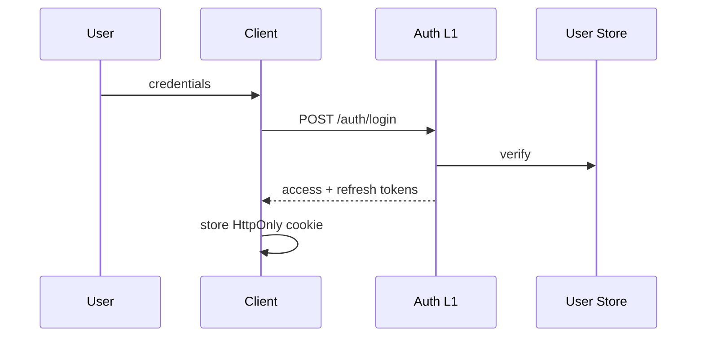

# 14 — Security Lifecycle

**Status:** Official SSOT · **Version:** 1.0.0 · **Decision:** D-PB-14, D-PB-06

---

## Authentication flow

| Method | Behavior |
|--------|----------|
| Password | bcrypt verify |
| MFA | TOTP when enabled |
| SSO | OAuth2/OIDC (future) |
| Dev auto-login | Disabled in production |

---

## Session lifecycle

| Token | TTL | Storage |
|-------|-----|---------|
| Access | 15 min | HttpOnly cookie / Bearer |
| Refresh | 7 days | Secure storage |
| Sliding | Refresh extends 7d | On activity |

---

## Authorization lifecycle

Evaluated every request at RT-5 — no stale permission cache >5s.

| Check | Fail code |
|-------|-----------|
| Tenant active | MAK-L1-SECURITY-001 |
| User running | MAK-L1-SECURITY-002 |
| Permission denied | MAK-L1-SECURITY-003 |

---

## Renewal

| Trigger | Behavior |
|---------|----------|
| Access expired | Silent refresh if refresh valid |
| Refresh expired | Re-login |
| Permission change | Next request picks up |

---

## Revocation

| Trigger | Behavior |
|---------|----------|
| Logout | Invalidate refresh token |
| Admin block | Immediate — all sessions |
| Password change | All sessions except current |
| Tenant suspend | All tenant sessions |

Fail-closed: revoked token → 401, no fallback.

---

## Events

`security.login.success`, `security.login.failed`, `security.session.refreshed`, `security.session.revoked`, `security.permission.denied`

---

*End of document.*
