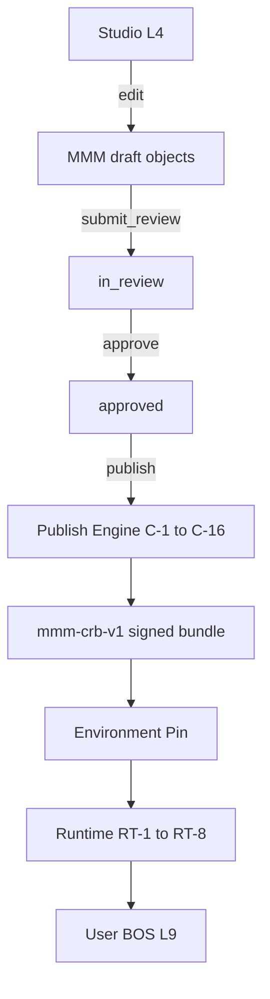

# 15 — Deployment Lifecycle

**Status:** Official SSOT · **Version:** 1.0.0 · **Decision:** D-PB-16

---

## End-to-end path

**No skip paths.** Each stage gate enforced (D-PB-06).

---

## Stage behavior

| Stage | Actor | Input | Output | Failure |
|-------|-------|-------|--------|---------|
| Studio | Expert | Design intent | MMM draft | Validation errors inline |
| MMM | API | Envelopes | Persisted objects | 409 revision conflict |
| Review | Reviewer | draft scope | approved/rejected | Reject → author fixes |
| Publish | Engine | approved scope | CRB + DefinitionVersion | C-5 validation fail |
| CRB | Signer | Compiled bundle | Signed artifact | Signature fail |
| Pin | Admin | bundleId + env | Active reference | Prior pin kept |
| Runtime | Bridge | Pin | Hydrated registries | Fail-closed maintenance |
| User | End user | Route | Rendered screen | 403/404 |

---

## Environment promotion

| Rule | Behavior |
|------|----------|
| Same CRB | Promoted by pin change only |
| Staging first | Required before production |
| Rollback | Pin to prior DefinitionVersion |

---

## Timing bounds

| Stage | Target latency |
|-------|----------------|
| Studio save | <2s |
| Publish compile | <60s typical scope |
| Cache invalidate | <5s |
| Runtime hydrate | <3s cold, <500ms warm |

---

## Events

`deployment.studio.saved`, `deployment.mmm.approved`, `deployment.publish.started`, `deployment.publish.completed`, `deployment.pin.changed`, `deployment.runtime.ready`

---

*End of document.*
