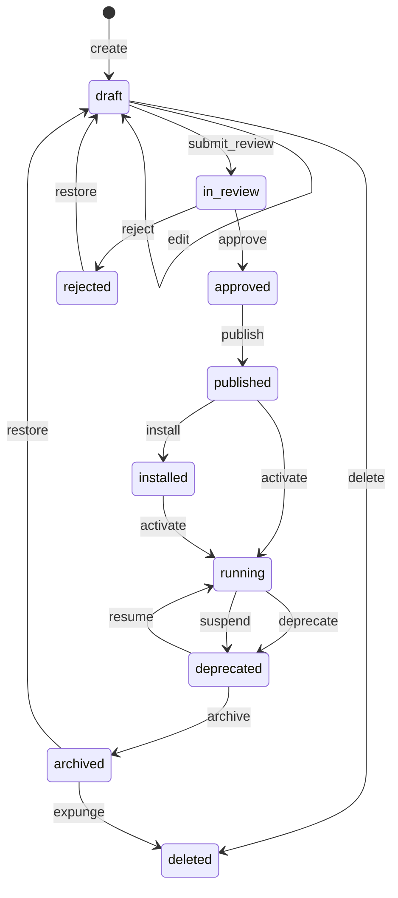

# 16 — Universal State Machine (USM)

**Status:** Official SSOT · **Version:** 1.0.0 · **Decision:** D-PB-01, D-PB-02, D-PB-03

---

## Rule

**One state machine for the entire platform.** Every object — MMM definition, tenant binding, user, record, workflow instance — uses states from this catalog. Object-type **profiles** restrict which states apply; they do **not** define alternate machines.

MMM operations in [meta-model/03-OBJECT-LIFECYCLE.md](../meta-model/03-OBJECT-LIFECYCLE.md) map to USM operations below.

---

## Universal states (10)

| State | Code | Description | Runtime visible |
|-------|------|-------------|-----------------|
| Draft | `draft` | Work in progress | No |
| In Review | `in_review` | Awaiting approval | No |
| Approved | `approved` | Approved, not published | No |
| Rejected | `rejected` | Review failed | No |
| Published | `published` | Compiled / immutable definition | After pin (read) |
| Installed | `installed` | Bound to tenant, not live | No |
| Running | `running` | Active in production | Yes |
| Deprecated | `deprecated` | Superseded, read-only | Yes (read-only) |
| Archived | `archived` | Out of active scope | No |
| Deleted | `deleted` | Soft delete, audit retained | No |

### MMM mapping

| MMM status | USM state |
|------------|-----------|
| `draft` | `draft` |
| `review` | `in_review` |
| `approved` | `approved` |
| `rejected` | `rejected` |
| `published` | `published` |
| — | `installed` |
| `active` | `running` |
| `deprecated` | `deprecated` |
| `archived` | `archived` |
| `deleted` | `deleted` |

---

## Universal operations (20)

| Operation | Typical transition | Actor |
|-----------|-------------------|-------|
| `create` | → `draft` | Studio, Import, AI→Intent |
| `edit` | `draft` → `draft` | Author |
| `submit_review` | `draft` → `in_review` | Author |
| `approve` | `in_review` → `approved` | Reviewer |
| `reject` | `in_review` → `rejected` | Reviewer |
| `publish` | `approved` → `published` | Publish Engine |
| `install` | `published` → `installed` | Marketplace / Admin |
| `activate` | `published`/`installed` → `running` | Environment Pin |
| `deprecate` | `running` → `deprecated` | Publish (new version) |
| `archive` | `deprecated` → `archived` | Admin |
| `restore` | `rejected`/`archived` → `draft` | Admin |
| `clone` | any → `draft` (new id) | Studio, Marketplace |
| `fork` | `published` → `draft` (new branch) | Studio |
| `rollback` | `running` → `deprecated` + pin prior | Environment Pin |
| `delete` | `draft`/`rejected` → `deleted` | Admin |
| `suspend` | `running` → `deprecated` | Admin (tenant/user) |
| `resume` | `deprecated` → `running` | Admin |
| `upgrade` | plan/version change | Platform |
| `downgrade` | plan/version change | Platform |
| `expunge` | `archived` → `deleted` (irreversible) | Compliance |

---

## State diagram (full)

---

## Object profiles

Profiles select **subset** of states and allowed transitions. Invalid transition → `MAK-L2-LIFECYCLE-001`.

| Profile | Object types | States used | Notes |
|---------|--------------|-------------|-------|
| **DEFINITION** | application, module, business_object, field, layout, workflow, action, permission | draft → published (+ rejected, deleted) | Full authoring path |
| **DEPLOYMENT** | environment_pin, tenant_application | published, installed, running, deprecated | Tenant-scoped |
| **DATA** | business record (L0) | draft, running, archived, deleted | No publish |
| **INSTANCE** | workflow_instance, job_run | running sub-states only | See D-PB-10 |
| **IDENTITY** | user, tenant | draft, running, deprecated, archived, deleted | User/tenant profiles |
| **PACKAGE** | marketplace package | draft, in_review, published, deprecated, deleted | Publisher scope |

### Field profile (DEFINITION subset)

Field skips `installed` — transitions: `draft` → `in_review` → `approved` → `published` → `running` (via parent module pin).

### Workflow definition vs instance

| Artifact | Profile | States |
|----------|---------|--------|
| `workflow` MMM object | DEFINITION | Full through `published` |
| `workflow_instance` | INSTANCE | `idle`, `running`, `waiting`, `completed`, `failed`, `cancelled` mapped under USM `running` |

---

## Side effects (mandatory)

| Operation | Events emitted | Audit |
|-----------|----------------|-------|
| All transitions | `object.lifecycle.transitioned` | Yes |
| `publish` | `object.published`, `mmm.publish.completed` | Yes |
| `activate` | `object.activated`, `runtime.crb.loaded` | Yes |
| `rollback` | `object.rollback`, `runtime.crb.loaded` | Yes |
| `delete` | `object.deleted` | Yes |

---

## Enforcement

| Layer | Enforcement |
|-------|-------------|
| MMM API | Validates operation + current state |
| Publish Engine | Only accepts `approved` scope |
| Environment Pin | Only `published` DefinitionVersions |
| Runtime | Only `running` CRB content |
| Studio | UI disables invalid operations |

---

*End of document.*
