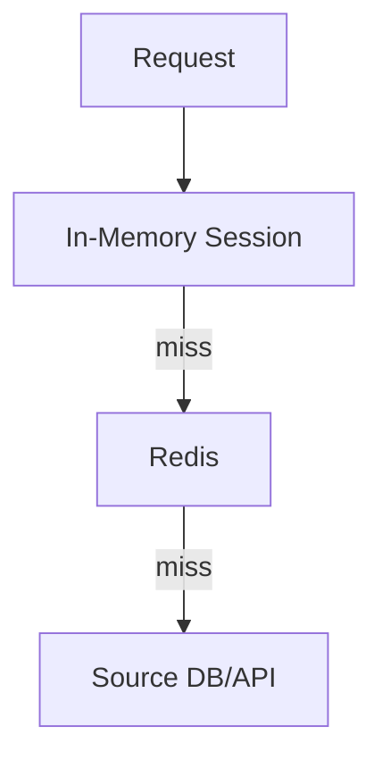

# 21 — Universal Caching

**Status:** Official SSOT · **Version:** 1.0.0 · **Decision:** D-PB-13

> **Note:** Cache tiers **L1 / L2 / L3** below denote **cache depth** (in-memory → Redis → source). They are **not** platform architecture layers (L0–L10). See [platform-architecture/01-LAYERS.md](../platform-architecture/01-LAYERS.md) (D-PA-01).

---

## Cache layers

---

## Cache keys

| Key pattern | Content | TTL |
|-------------|---------|-----|
| `pin:{tenant}:{app}:{env}` | EnvironmentPin | 60s |
| `mmm:crb:{tenant}:{module}` | Hydrated CRB | 300s |
| `auth:scope:{userId}` | AccessScope | 5s |
| `gr:list:{bo}:{hash}` | List query result | 30s |
| `schema:registry` | AJV schemas | Until restart |

---

## Invalidation

| Trigger | Keys invalidated |
|---------|------------------|
| `mmm.publish.completed` | `mmm:crb:*` for scope |
| Pin change | `pin:*` + `mmm:crb:*` |
| Permission change | `auth:scope:{userId}` |
| Record write | `gr:list:{bo}:*` for BO |

Target: <5s eventual consistency (D-PB-13).

---

## Versioning

| Rule | Behavior |
|------|----------|
| CRB cache | Key includes `definitionVersionId` |
| Stale serve | Never — verify version on hit |
| Thundering herd | Single-flight lock on hydrate |

---

## Rules

| Rule | Detail |
|------|--------|
| CRB | Never cache unsigned bundle |
| Tenant | Keys always tenant-scoped |
| Redis down | Degrade to DB — no fail |
| User data | No PII in shared cache |

---

*End of document.*
