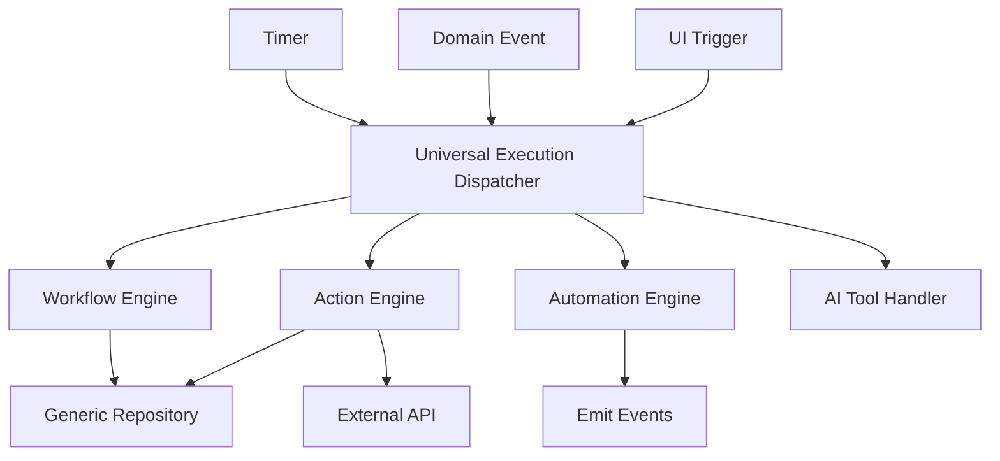

# 23 — Universal Execution Model

**Status:** Official SSOT · **Version:** 1.0.0 · **Decision:** D-PB-30

---

## Single dispatcher

All execution routes through **Universal Execution Dispatcher (UED)** at RT-8.



---

## Runtime execution

Per D-PB-32, all execution uses UEP pipeline stages. RT-5 authorize = UEP stage 2.

| UEP stage | Behavior |
|-----------|----------|
| 1 Validate | Envelope, UEC, business preconditions |
| 2 Authorize | RT-5 permission check |
| 3 Execute | Load handler; transaction boundary; post-commit events |
| 4 Audit | Immutable audit record |
| 5 Respond | Structured result |

---

## Action Engine execution

| actionKind | Handler |
|------------|---------|
| crud | GR create/update/delete |
| navigate | Router push |
| workflow | Start workflow instance |
| integration | External API call |
| marketplace | Install/update package |
| lifecycle | MMM operation (Studio scope) |

---

## Workflow execution

| Step | Behavior |
|------|----------|
| Start | Create instance (idle→running) |
| Step | Execute step handler |
| Human | Transition to waiting |
| Timer | Scheduler callback → UED |
| Complete | Terminal state + events |

Single active step per instance.

---

## Automation execution

| Trigger | Behavior |
|---------|----------|
| `record.created` | Match rules → UED |
| `record.updated` | Field change rules |
| Schedule | Cron → UED |

Rules from CRB automation registry (V19 extension).

---

## AI execution

| Step | Behavior |
|------|----------|
| Request | AI Gateway — rate limited |
| Tool call | Read-only queries only |
| Output | AICandidate — never direct write |
| Approval | Human gate before UED mutates |

---

## Execution result

```json
{
  "success": true,
  "executionId": "uuid",
  "traceId": "uuid",
  "data": {},
  "events": ["record.updated"],
  "errors": []
}
```

---

*End of document.*
