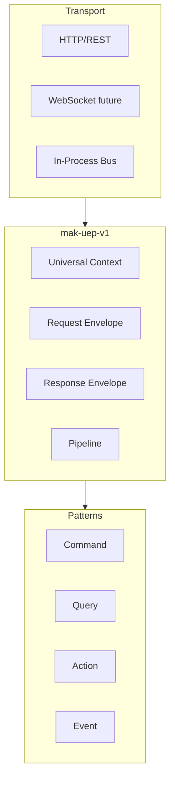

# 01 — Universal Execution Protocol (UEP)

**Status:** Official SSOT · **Version:** 1.0.0 · **Decision:** D-UP-01

---

## Definition

The **Universal Execution Protocol (UEP)** is the single wire-level and in-process contract governing how every MAK component initiates, routes, executes, observes, and completes work.

**Runtime (Foundation C) implements UEP — it does not define it.**

---

## Protocol stack



---

## Communication rules

| Rule | Detail |
|------|--------|
| UEP-01 | Every operation carries a **Universal Context** ([02-UNIVERSAL-CONTEXT.md](./02-UNIVERSAL-CONTEXT.md)) |
| UEP-02 | Mutations use **Command** or **Action** envelopes |
| UEP-03 | Reads use **Query** envelopes |
| UEP-04 | Side-effects notify via **Event** envelopes (post-commit) |
| UEP-05 | All messages include `protocolVersion`, `messageId`, `timestamp` |
| UEP-06 | Tenant scope mandatory on every message (R-05) |
| UEP-07 | Fail-closed on unknown message type (D-PB-06) |
| UEP-08 | Idempotency via `idempotencyKey` on commands (D-PB-12) |

---

## Message types

| Type | Direction | Mutates state |
|------|-----------|---------------|
| `command` | Client → Platform | Yes |
| `query` | Client → Platform | No |
| `action` | UI/Runtime → Engine | Yes |
| `event` | Platform → Subscribers | No (notification) |
| `response` | Platform → Client | — |
| `asyncAck` | Platform → Client | — (job accepted) |

---

## Component roles

| Component | UEP role |
|-----------|----------|
| Studio | Command issuer (MMM mutations) |
| Publish Engine | Command processor (compile) |
| Runtime | Query + Action host |
| Action Engine | Action handler dispatcher |
| Workflow Engine | Command + Event consumer |
| AI Gateway | Query + Command (AICandidate only) |
| Marketplace | Command (install) + Event |
| Generic Repository | Command/Query target |

---

## Envelope header (all messages)

```json
{
  "protocolVersion": "mak-uep-v1",
  "messageId": "uuid",
  "correlationId": "uuid",
  "traceId": "uuid",
  "timestamp": "ISO8601",
  "messageType": "command|query|action|event|response",
  "context": { }
}
```

Body varies by message type — see topics 03–08.

---

## Layer binding

| Layer | UEP entry point |
|-------|-----------------|
| L4 Studio | HTTP → Command |
| L3 Runtime | In-process → Action/Query |
| L2 MMM/Publish | HTTP → Command |
| L1 Platform Core | Pipeline services |
| L6 AI Gateway | HTTP → Command (bounded) |
| L7 Marketplace | HTTP → Command |

---

*End of document.*
