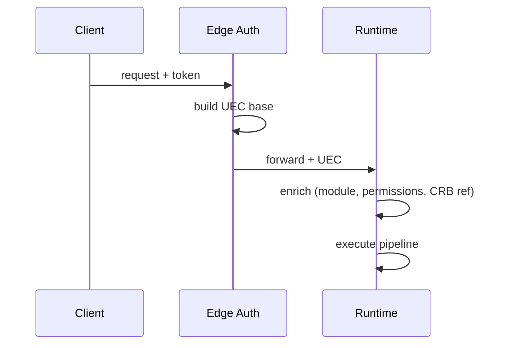

# 02 — Universal Context (UEC)

**Status:** Official SSOT · **Version:** 1.0.0 · **Decision:** D-UP-02

---

## Definition

**Universal Execution Context (UEC)** — immutable per request snapshot of everything required to authorize, execute, observe, and audit an operation.

Every UEP message embeds or references UEC. **Nothing executes without UEC.**

---

## Context schema (`mak-uec-v1`)

```json
{
  "tenant": {
    "tenantId": "uuid",
    "tenantCode": "string",
    "plan": "free|business|enterprise|platform",
    "status": "running|deprecated|archived"
  },
  "company": {
    "companyId": "uuid",
    "companyCode": "string",
    "ouId": "uuid|null"
  },
  "application": {
    "applicationId": "uuid",
    "applicationCode": "string"
  },
  "module": {
    "moduleId": "uuid",
    "moduleCode": "string"
  },
  "user": {
    "userId": "uuid",
    "login": "string",
    "roles": ["roleCode"],
    "groups": ["groupCode"]
  },
  "locale": {
    "language": "pt-BR",
    "timezone": "America/Sao_Paulo",
    "currency": "BRL"
  },
  "permissions": {
    "effective": ["resource:action"],
    "computedAt": "ISO8601"
  },
  "environment": {
    "name": "development|staging|production",
    "definitionVersionId": "uuid",
    "bundleId": "uuid"
  },
  "session": {
    "sessionId": "uuid",
    "issuedAt": "ISO8601",
    "expiresAt": "ISO8601"
  },
  "featureFlags": {
    "flags": { "key": true }
  },
  "executionScope": {
    "scopeType": "platform|tenant|application|module|record",
    "scopeRef": "uuid"
  },
  "correlationId": "uuid",
  "traceId": "uuid",
  "client": {
    "channel": "web|mobile|desktop|api|studio|system",
    "userAgent": "string",
    "ipHash": "string"
  }
}
```

---

## Field rules

| Field | Required | Source |
|-------|----------|--------|
| tenant | Always | Auth token |
| user | Always (except system jobs) | Auth |
| company | Runtime ops | User selection |
| application | Runtime ops | Route/pin |
| module | Runtime ops | Route |
| permissions | Mutations | RT-5 compute |
| environment | Runtime | EnvironmentPin |
| session | Authenticated | Auth service |
| featureFlags | Always | L1 plan + tenant |
| executionScope | Always | Derived from operation |
| correlationId | Always | Client or generated |
| traceId | Always | Generated at edge |

---

## Context lifecycle



| Phase | Enrichment |
|-------|------------|
| Edge | tenant, user, session, traceId |
| Runtime bootstrap | application, module, environment, bundleId |
| Pre-execute | permissions, executionScope |

**Rule:** UEC is **immutable** after pipeline stage `authorize` completes.

---

## System context

Background jobs use **System UEC**:

| Field | Value |
|-------|-------|
| user.userId | `system` |
| client.channel | `system` |
| executionScope.scopeType | `tenant` or `platform` |

System jobs carry explicit `tenantId` — never global unscoped mutations.

---

*End of document.*
