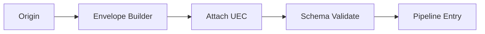

# 03 — Universal Request

**Status:** Official SSOT · **Version:** 1.0.0 · **Decision:** D-UP-03

---

## Request birth

Every operation begins as a **Universal Request** at the platform edge (HTTP, in-process, or job dequeue).



---

## Request envelope

```json
{
  "header": {
    "protocolVersion": "mak-uep-v1",
    "messageId": "uuid",
    "correlationId": "uuid",
    "traceId": "uuid",
    "timestamp": "ISO8601",
    "messageType": "command|query|action",
    "idempotencyKey": "uuid|null"
  },
  "context": { },
  "body": {
    "kind": "string",
    "target": "string",
    "payload": { },
    "options": {
      "async": false,
      "timeoutMs": 30000,
      "dryRun": false
    }
  }
}
```

---

## Request kinds

| messageType | body.kind examples | Mutates |
|-------------|-------------------|---------|
| command | `mmm.object.create`, `publish.execute`, `marketplace.install` | Yes |
| query | `record.get`, `record.list`, `schema.lookup` | No |
| action | `save`, `delete`, `triggerWorkflow` | Yes |

---

## Origin mapping

| Origin | Typical request |
|--------|-----------------|
| Studio | `command` → MMM API |
| BOS UI | `action` → Runtime |
| BOS list | `query` → GR |
| Publish trigger | `command` → Publish Engine |
| Event handler | `command` (derived) |
| Scheduler | `command` with System UEC |
| AI Gateway | `command` → `ai.candidate.create` only |

---

## Validation (ingress)

| Check | Fail code |
|-------|-----------|
| protocolVersion supported | MAK-UEP-001 |
| Schema valid | MAK-UEP-002 |
| UEC complete | MAK-UEP-003 |
| idempotencyKey format | MAK-UEP-004 |
| Tenant active | MAK-L1-SECURITY-001 |

---

## Options

| Option | Default | Use |
|--------|---------|-----|
| async | false | Long operations → job |
| timeoutMs | 30000 | Handler bound |
| dryRun | false | Validate only, no commit |

---

*End of document.*
