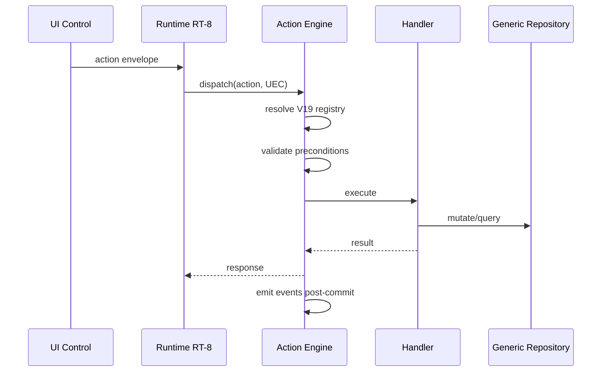

# 07 — Universal Action

**Status:** Official SSOT · **Version:** 1.0.0 · **Decision:** D-UP-07

---

## Action vs Command

| Aspect | Action | Command |
|--------|--------|---------|
| Origin | UI / Runtime RT-8 | API / Studio / System |
| Registry | CRB V19 | Platform handler registry |
| User-facing | Yes (buttons) | Often internal |

Actions **wrap** commands or invoke specialized handlers.

---

## Action envelope

```json
{
  "header": { "messageType": "action" },
  "body": {
    "actionCode": "save",
    "actionKind": "crud",
    "targetRef": { "boCode": "empresa", "recordId": "uuid|null" },
    "payload": { },
    "confirmationToken": "uuid|null"
  }
}
```

---

## Lifecycle



---

## Who calls

| Caller | Actions |
|--------|---------|
| BOS form button | save, delete, duplicate |
| BOS toolbar | export, refresh, navigate |
| Workflow human step | approve, reject |
| Automation | system actions |

---

## Validation

| Stage | Check |
|-------|-------|
| Registry | actionCode exists in CRB V19 |
| Permission | action.permissionRef satisfied |
| Precondition | V16 validation rules |
| Confirmation | Required for destructive ops |

---

## Cancel

| Scenario | Behavior |
|----------|----------|
| User cancel dialog | No request sent |
| In-flight timeout | Response error, TX rollback |
| Workflow waiting | `workflow.signal` cancel |

---

## Undo

| actionKind | Undo support |
|------------|--------------|
| crud update | Optional version restore (BO policy) |
| crud delete | Soft delete → restore command |
| navigate | Browser back — no server undo |
| publish | Rollback via pin — not undo |

Undo emits `command` `record.restore` or `publish.rollback` — never silent revert.

---

*End of document.*
