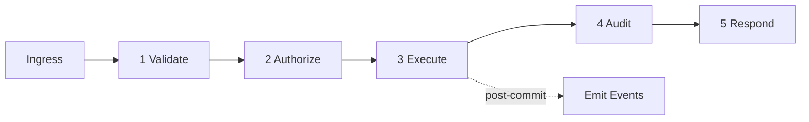

# 09 — Universal Pipeline

**Status:** Official SSOT · **Version:** 1.0.0 · **Decision:** D-UP-09

---

## Pipeline stages (mandatory order)

Every Command, Action, and mutating internal operation passes all stages. Queries skip Execute mutation but still Validate + Authorize.

---

## Stage 1 — Validate

| Check | Applies to |
|-------|------------|
| Envelope schema | All |
| UEC completeness | All |
| Business validation (V16) | Command, Action |
| USM transition valid | Lifecycle commands |
| Idempotency | Command |

Fail → `status: error`, no later stages.

---

## Stage 2 — Authorize

Centralized — [12-UNIVERSAL-PERMISSIONS.md](./12-UNIVERSAL-PERMISSIONS.md).

| Check | Fail code |
|-------|-----------|
| Tenant active | MAK-L1-SECURITY-001 |
| User active | MAK-L1-SECURITY-002 |
| Permission | MAK-L1-SECURITY-003 |
| Plan feature | MAK-L1-SECURITY-006 |

**UEC frozen after this stage.**

---

## Stage 3 — Execute

| Step | Responsibility |
|------|----------------|
| Resolve handler | Registry lookup |
| Begin TX | If mutating |
| Run handler | Business logic |
| Commit TX | Or rollback |
| Emit events | Post-commit queue |

---

## Stage 4 — Audit

| Log | Level |
|-----|-------|
| Mutation summary | audit |
| Permission deny | audit + warn |
| Execution duration | info |

Append-only audit stream — [platform-behavior/19-UNIVERSAL-LOGGING.md](../platform-behavior/19-UNIVERSAL-LOGGING.md).

---

## Stage 5 — Respond

Build [Universal Response](./04-UNIVERSAL-RESPONSE.md) with status, data, errors, meta.

---

## Pipeline variants

| Path | Stages |
|------|--------|
| Query | Validate → Authorize → Execute(read) → Respond |
| Command | Full pipeline |
| Action | Full pipeline |
| Event consumer | Validate → Authorize(system) → Execute → Audit |
| Async job | Dequeue → full pipeline with System UEC |

---

*End of document.*
