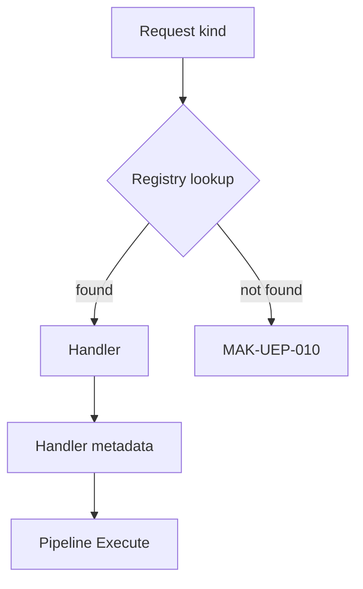

# 10 — Universal Handler

**Status:** Official SSOT · **Version:** 1.0.0 · **Decision:** D-UP-10

---

## Handler definition

A **Handler** is a registered function that processes one `kind` (command/query/action).

```json
{
  "handlerId": "mmm.object.create",
  "version": "1.0.0",
  "messageTypes": ["command"],
  "kind": "mmm.object.create",
  "mutates": true,
  "requiresTx": true,
  "timeoutMs": 30000,
  "idempotent": true
}
```

---

## Registration

| Registry | Scope | Source |
|----------|-------|--------|
| Platform handlers | L1/L2 | Code manifest at boot |
| CRB action handlers | L3 | V19 at hydrate |
| CRB workflow steps | L3 | V20 at hydrate |
| Plugin handlers | L3 | CRB integration registry |
| Connector handlers | L1 | Connector manifest |

Registration at **boot** (platform) or **hydrate** (CRB). No dynamic remote registration in production (D-PA-23).

---

## Discovery



Lookup order: CRB registry → Platform registry → Plugin registry.

---

## Execution

| Property | Enforcement |
|----------|-------------|
| timeoutMs | Hard kill + TX rollback |
| requiresTx | Wrapped in transaction |
| idempotent | Checked via idempotencyKey store |
| mutates | Events allowed post-commit |

Handler **never** accesses registry outside its declared dependencies.

---

## Built-in handler namespaces

| Prefix | Owner |
|--------|-------|
| `mmm.*` | MMM Service |
| `publish.*` | Publish Engine |
| `record.*` | Generic Repository |
| `workflow.*` | Workflow Engine |
| `action.*` | Action Engine |
| `ai.*` | AI Gateway |
| `marketplace.*` | Marketplace |
| `security.*` | Auth |

---

*End of document.*
