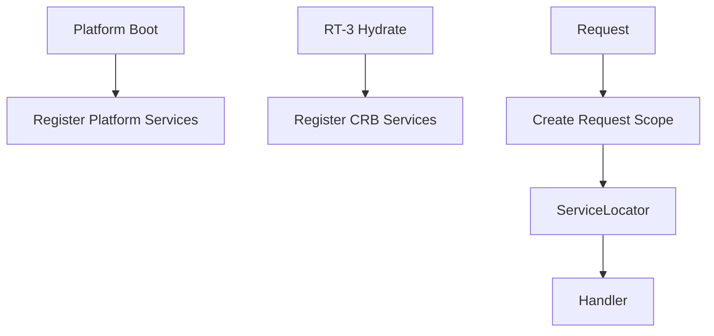

# 11 — Universal Services

**Status:** Official SSOT · **Version:** 1.0.0 · **Decision:** D-UP-11

---

## Service registry

All platform services register at boot in **Universal Service Registry (USR)**.

| Service | Interface | Lifetime |
|---------|-----------|----------|
| AuthService | authenticate, refresh, revoke | Singleton |
| PermissionService | evaluate, listEffective | Singleton |
| MmmRepository | CRUD envelopes | Singleton |
| PublishService | compile, sign | Singleton |
| GenericRepository | record CRUD | Scoped |
| EventBus | publish, subscribe | Singleton |
| CacheService | get, set, invalidate | Singleton |
| JobScheduler | enqueue, schedule | Singleton |
| AuditService | append | Singleton |
| Navigator | resolve route | Session |
| RegistryAccessor | V13–V20 | Session |

---

## Service locator

Runtime resolves services via **ServiceLocator** bound to UEC:

```
locator.get<T>(token: ServiceToken): T
```

| Rule | Detail |
|------|--------|
| SL-01 | Handlers receive locator, not concrete classes |
| SL-02 | Scoped services bound to request/job |
| SL-03 | CRB services only after RT-3 hydrate |

---

## Dependency injection



| Lifetime | Scope |
|----------|-------|
| Singleton | Process |
| Session | User session |
| Request | Single pipeline execution |
| Scoped | Tenant operation |

---

## Service discovery

| Environment | Mechanism |
|-------------|-----------|
| Monolith | In-process USR |
| Multi-replica | Same code manifest — no dynamic discovery |
| Future mesh | Static service map — UEP unchanged |

**No** runtime service discovery from network in v1.

---

*End of document.*
