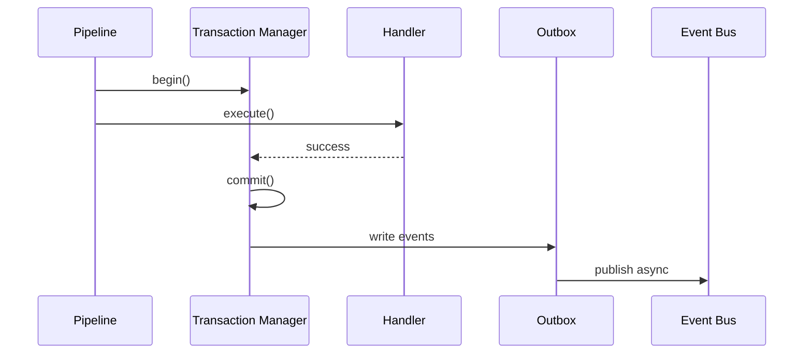

# 13 — Universal Transactions

**Status:** Official SSOT · **Version:** 1.0.0 · **Decision:** D-UP-13

---

## Protocol flow

---

## Boundaries

| Operation | TX scope |
|-----------|----------|
| Single command | One DB transaction |
| MMM batch | One transaction |
| Record CRUD | One GR transaction |
| Publish compile | TX + immutable CRB write |
| Cross-service | Saga (see below) |

---

## Commit

| Rule | Detail |
|------|--------|
| TX-01 | Commit before event publish |
| TX-02 | Outbox in same TX as mutation when required |
| TX-03 | Response sent after commit |

---

## Rollback

| Trigger | Behavior |
|---------|----------|
| Handler exception | Full rollback |
| Validation fail | No TX started |
| Timeout | Rollback + error response |
| Partial batch | All-or-nothing per batch policy |

---

## Retry

| Layer | Policy |
|-------|--------|
| Client | idempotencyKey + retry on retryable |
| Pipeline | 0 retries (fail fast) |
| Event consumer | 3× backoff |
| Job | 3× → DLQ |

---

## Compensation (Saga)

Cross-plane operations (publish → pin → cache invalidate):

| Step | Compensating action |
|------|---------------------|
| publish OK, pin fail | Alert — manual pin |
| pin OK, cache fail | Retry invalidate |
| install OK, validate fail | archive draft objects |

Saga state stored in `saga_instance` — events drive forward/backward.

Behavior detail: [platform-behavior/22-UNIVERSAL-TRANSACTIONS.md](../platform-behavior/22-UNIVERSAL-TRANSACTIONS.md).

---

*End of document.*
