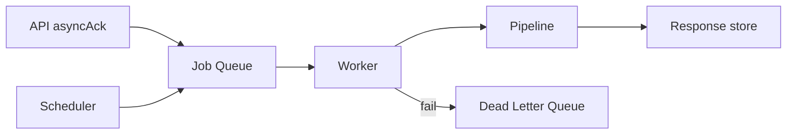

# 15 — Universal Async

**Status:** Official SSOT · **Version:** 1.0.0 · **Decision:** D-UP-15

---

## Async model

Long operations return `asyncAck` and continue as **Job**.

```json
{
  "jobId": "uuid",
  "kind": "publish.execute",
  "status": "queued|running|completed|failed|cancelled",
  "uec": { },
  "payload": { },
  "attempts": 0,
  "maxAttempts": 3,
  "createdAt": "ISO8601",
  "completedAt": "ISO8601|null"
}
```

---

## Components



---

## Queue types

| Queue | Purpose |
|-------|---------|
| job-queue | User-initiated async |
| event-outbox | Reliable event delivery |
| scheduler | Cron timers |
| dlq | Failed jobs |

---

## Worker contract

| Rule | Detail |
|------|--------|
| WORK-01 | Worker runs full pipeline with System UEC |
| WORK-02 | Idempotent by jobId |
| WORK-03 | 3 attempts — exponential backoff |
| WORK-04 | DLQ after max attempts — alert ops |

---

## Scheduler

| Job type | Example |
|----------|---------|
| Cron | Workflow SLA timers |
| Delayed | Reminder notifications |
| Recurring | Tenant backup |

Timers **never** use browser — L1 only ([platform-behavior/06-WORKFLOW](../platform-behavior/06-WORKFLOW-LIFECYCLE.md)).

---

## Client polling

```
GET /api/jobs/{jobId} → Universal Response with job status
```

Or subscribe to `job.completed` event.

---

*End of document.*
