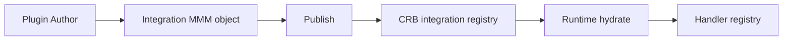

# 16 — Universal Plugins

**Status:** Official SSOT · **Version:** 1.0.0 · **Decision:** D-UP-16, D-PA-23

---

## Plugin model

Plugins are **Integration** MMM objects compiled into CRB — not dynamic remote code.

```json
{
  "pluginId": "uuid",
  "pluginCode": "stripe-payments",
  "manifestVersion": "mak-plugin-v1",
  "handlers": [
    { "kind": "integration.charge", "handlerRef": "stripe.charge" }
  ],
  "permissions": ["payment:charge"],
  "signatureRef": "hmac..."
}
```

---

## Registration flow



---

## Discovery

At RT-3 hydrate: merge CRB integration registry into handler registry.

Lookup: `integration.{connectorCode}.{operation}`

---

## Load rules

| Rule | Detail |
|------|--------|
| PLG-01 | Signature verified before register |
| PLG-02 | Permissions declared in manifest |
| PLG-03 | No network fetch of code at runtime |
| PLG-04 | Sandbox: connector API calls only |

---

## Unload

| Trigger | Behavior |
|---------|----------|
| CRB deprecate | Handlers removed on next hydrate |
| Pin rollback | Previous CRB plugins restored |
| Tenant uninstall | Integration archived — no handlers |

---

*End of document.*
